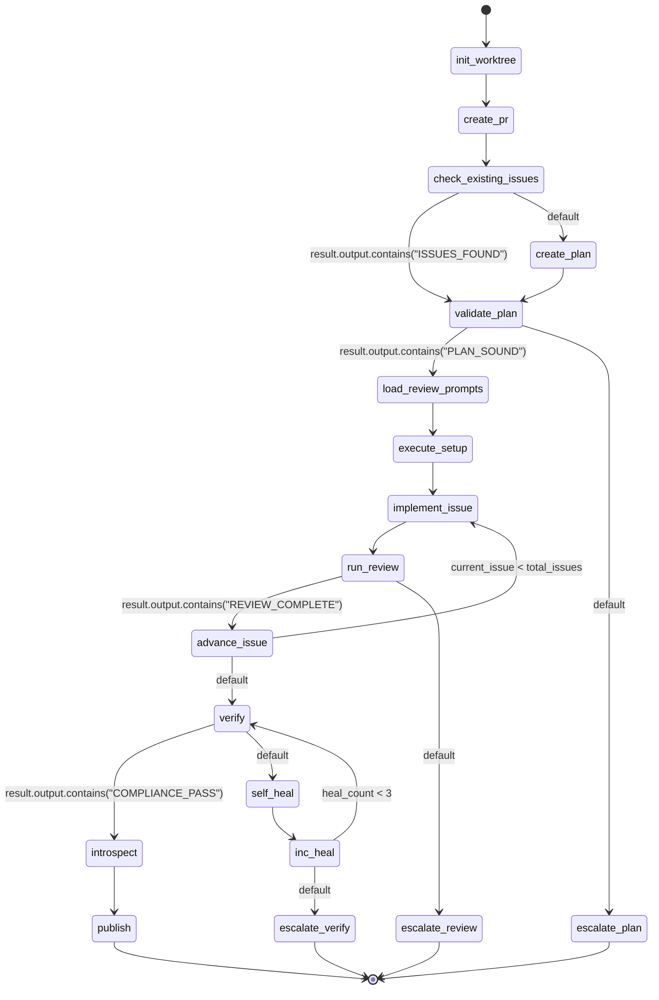

## Actions
- init_worktree: shell "BRANCH=feat/$(echo '{{spec_file}}' | sed 's/.*\///;s/\.md$//;s/[[:upper:]]/\L&/g;s/ /-/g') && WTPATH={{worktree_base}}/$BRANCH && git worktree add -b $BRANCH $WTPATH main 2>/dev/null || true && cd $WTPATH && echo WORKTREE=$(pwd) && echo BRANCH=$BRANCH"
- create_pr: shell "cd {{worktree}} && git commit -m 'chore: init tracking for {{spec_file}}' --allow-empty && git push -u origin {{branch}} 2>/dev/null && gh pr create --title 'feat: {{spec_title}}' --body 'Implements {{spec_file}}' --draft --base main --head {{branch}} 2>/dev/null | tail -1 && echo PR_CREATED"
- check_existing_issues: subagent explorer with task="Search for existing open issues referencing {{spec_file}}. Use issues_search and issues_list to find issues whose descriptions mention this spec. If you find open/in_progress issues, list their IDs as a JSON array and output ISSUES_FOUND on its own line. If none found, output NO_ISSUES on its own line."
- create_plan: subagent implementer with task="Create an implementation plan for specification {{spec_file}}. Read the spec file, then use the writing-plans skill to break it into implementable issues (use issues_create for each). Work in {{worktree}}. Output: PLAN_CREATED followed by a JSON array of issue IDs like [\"ISS-000001\", \"ISS-000002\"]."
- validate_plan: subagent explorer with task="Review the implementation plan for {{spec_file}}. Read the spec, then read each issue from issue_ids={{issue_ids}}. Check: 1) Every requirement in the spec has at least one implementing issue. 2) Each issue has enough detail to implement. 3) No dependency conflicts. Output PLAN_SOUND if coverage >= 95%, or PLAN_NEEDS_WORK with gap details."
- load_review_prompts: shell "SPEC_PROMPT=''; QUAL_PROMPT=''; for f in {{worktree}}/.wingman/config/review-prompts/spec-compliance.md ~/.pi/agent/skills/initializing-governance/templates/review-prompts/spec-compliance.md; do [ -f \"$f\" ] && SPEC_PROMPT=$(cat \"$f\") && break; done; for f in {{worktree}}/.wingman/config/review-prompts/code-quality.md ~/.pi/agent/skills/initializing-governance/templates/review-prompts/code-quality.md; do [ -f \"$f\" ] && QUAL_PROMPT=$(cat \"$f\") && break; done; echo PROMPTS_LOADED"
- execute_setup: set: current_issue = 0
- implement_issue: subagent implementer with task="Implement issue {{current_issue_id}} in worktree {{worktree}} on branch {{branch}}. First run: cd {{worktree}} && echo Directory:$(pwd) && echo Branch:$(git branch --show-current) to verify location. Read the issue with issues_get(id:'{{current_issue_id}}', include_body: true). Follow TDD: write failing test, implement, verify tests pass. Commit only the files you changed (never use git add -A or git add .). Report: summary, test results, commit hash."
- run_review: run workflow "review-gate" with worktree="{{worktree}}" issue_id="{{current_issue_id}}" pr_number="{{pr_number}}" max_attempts="{{max_review_attempts}}" spec_review_prompt="{{spec_review_prompt}}" quality_review_prompt="{{quality_review_prompt}}"
- advance_issue: set: current_issue = {{current_issue + 1}}
- verify: subagent explorer with task="Verify compliance for {{spec_file}} implemented in {{worktree}}. Read the spec, check each acceptance criterion has implementing code and tests. Run tests: cd {{worktree}} && npm test 2>&1. Check git status is clean. Output COMPLIANCE_PASS with percentage, or COMPLIANCE_GAPS with details of unmet criteria."
- self_heal: subagent implementer with task="Fix compliance gaps in {{worktree}} for {{spec_file}}. The verifier found these issues: {{result.output}}. Create supplemental tests or code to address the gaps. Commit only the files you changed."
- inc_heal: set: heal_count = {{heal_count + 1}}
- introspect: shell "SESSION_FILE=$(ls -t ~/.pi/agent/sessions/*.jsonl 2>/dev/null | head -1) && if [ -n \"$SESSION_FILE\" ]; then echo INTROSPECT_COMPLETE; else echo INTROSPECT_SKIPPED; fi"
- publish: shell "cd {{worktree}} && git push && gh pr ready {{pr_number}} 2>/dev/null && echo PUBLISH_COMPLETE"
- escalate_plan: log "ESCALATE: Plan validation failed for {{spec_file}}. Issues: {{result.output}}"
- escalate_review: log "ESCALATE: Review gate failed for {{current_issue_id}} in {{spec_file}}. Feedback: {{result.output}}"
- escalate_verify: log "ESCALATE: Verification failed after 3 self-heal attempts for {{spec_file}}. Gaps: {{result.output}}"
