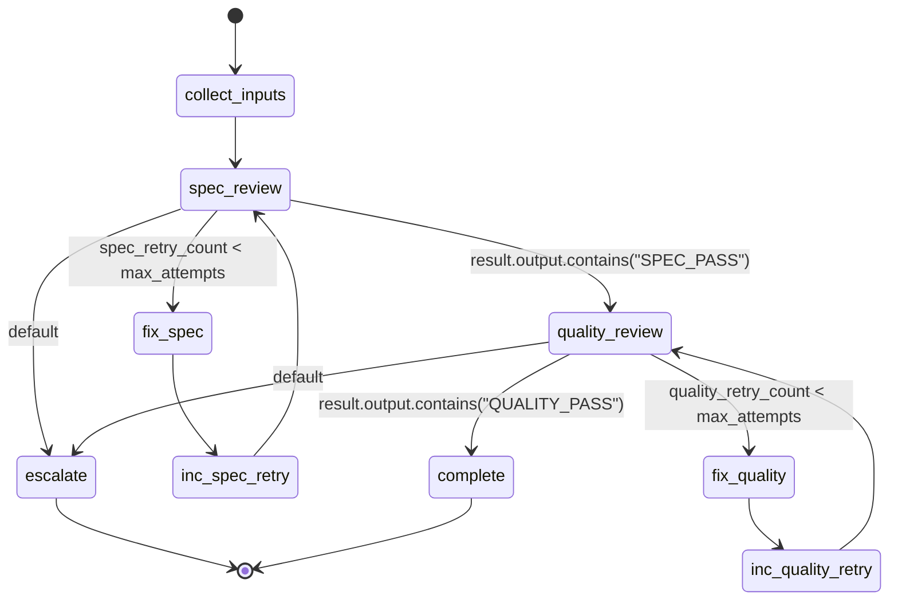

## Actions
- collect_inputs: shell "cd {{worktree}} && git diff HEAD~1 > /tmp/review-diff-{{issue_id}}.txt && echo INPUTS_COLLECTED"
- spec_review: subagent explorer with task="{{spec_review_prompt}}\n\nDiff file: /tmp/review-diff-{{issue_id}}.txt\nIssue: {{issue_id}}\n\nRead the diff file, then output SPEC_PASS or SPEC_FAIL on its own line."
- fix_spec: subagent implementer with task="Fix spec compliance issues in {{worktree}} for {{issue_id}}. Review feedback: see prior review output."
- inc_spec_retry: set: spec_retry_count = {{spec_retry_count + 1}}
- quality_review: subagent explorer with task="{{quality_review_prompt}}\n\nDiff file: /tmp/review-diff-{{issue_id}}.txt\n\nRead the diff file, then output QUALITY_PASS or QUALITY_FAIL on its own line."
- fix_quality: subagent implementer with task="Fix code quality issues in {{worktree}} for {{issue_id}}. Review feedback: see prior review output."
- inc_quality_retry: set: quality_retry_count = {{quality_retry_count + 1}}
- escalate: log "ESCALATE: Review failed after max attempts for {{issue_id}}"
- complete: log "REVIEW_COMPLETE: All reviews passed for {{issue_id}}"
