# Context on Existing State

## Business Context

### Key Entities

**Sea Shipping Line (SSL)** is a federally licensed NVOCC (Non-Vessel Operating Common Carrier) - the freight forwarding business that serves customers needing ocean shipping services. SSL negotiates rates with ocean carriers, maintains customer relationships, and handles quote requests.

**Exportfile** is a separate business under the same ownership that provides:

- Data entry and extraction services (primarily staffed out of the Philippines)
- Backend systems that SSL depends on, including:
  - The rates management database
  - The quote generation portal used by SSL staff
  - The customer self-serve portal

The division of labor: SSL handles customer-facing sales and relationships; Exportfile handles the technical systems and data operations that power SSL’s quoting capability.

## How Rates Work

### What Makes Up a Rate

A customer quote is calculated from two primary components:

**1. Carrier Rates** - Rates from the “steamship lines” (major ocean carriers like Maersk, MSC, etc.). These rates already have many variables baked in by the carriers:

- Carrier base rates
- Fuel costs
- Port fees
- At least 20 other standard fees
- Route-dependent surcharges (e.g., Red Sea piracy surcharge in 2025)

**2. SSL Margin** - The fee SSL adds on top of carrier rates. This margin:

- Gets negotiated between an SSL sales team member and a specific customer
- May vary by route
- Is usually straightforward, but can have complex arrangements (special rates for certain ports, carriers, or specific routes)

### How Rate Data Gets Into the System

1. **SSL team negotiates rates with carriers** - This happens on an ongoing basis
2. **Carriers send rate updates to SSL** - Typically in non-machine-readable formats (PDFs, documents)
3. **Exportfile team manually extracts rates** - Someone on the Exportfile team transcribes the new rates into a spreadsheet
4. **Automated import to database** - Once rates are in the spreadsheet, the import to the Azure database is automated
5. **Rates refresh frequency** - At least once per week

For customer margins:

- SSL Sales Team negotiates margin with customer
- Margin gets saved in the system (location TBD - may be same DB as carrier rates or separate)

**Open Questions (Rates):**

- Does SSL set margin at a level intended to cover incidental additional fees/costs in end-to-end transit? (e.g., customs fees, handoff point nuances)
- What are the other inputs to quotes that don’t come from carriers?
- Which system do SSL team members record customer-negotiated margins in? Is it the same DB as carrier rates?

## Quote Request Process

### Inbound Channels

When a customer needs a shipment quote, they can request one through several channels:

| Channel                      | Description                                                                       | Notes                                    |
| ---------------------------- | --------------------------------------------------------------------------------- | ---------------------------------------- |
| Email                        | Customer sends email with key details (container type, origin/destination, cargo) | Primary channel - focus of this document |
| WhatsApp/SMS                 | Some customers prefer messaging                                                   | Volume TBD                               |
| SSL Website Form             | “Request a Quote” form on seashipping.com                                         | Triggers email to SSL team               |
| Exportfile Self-Serve Portal | Customer logs in and generates own quotes                                         | Subset of customers only                 |

**For the purposes of this document, we are focusing on the email channel for quote requests.**

### Staff-Assisted Quote Flow (Email Channel)

Current process when a quote request arrives via email:

1. **Request arrives** - Customer emails SSL with shipment details
2. **SSL team reviews** - A team member reads the request and extracts relevant parameters
3. **Portal login** - Team member logs into the Exportfile internal portal
4. **Quote generation** - Team member inputs parameters and generates quote
5. **PDF export** - Portal produces PDF document(s) with the quote
6. **Response** - Team member attaches PDF(s) to email reply to customer

### Self-Serve Portal (Brief - Out of Scope for Changes)

Some SSL customers have access to the Exportfile self-serve portal:

- SSL margins are pre-set for the customer
- Routes visible in the portal are limited to specific routes the SSL team has entitled them to see
- This route-limiting is industry standard - freight forwarders avoid exposing their full rates book to prevent competitive intelligence leakage
- An SSL team member will have discussed relevant routes with the customer and scoped their portal access accordingly

**Open Questions (Quote Requests):**

- What’s the breakdown in usage across channels? Is email the majority?
- How often does the SSL team need follow-up clarification before generating a quote? (i.e., how often is a reply or phone call needed to collect missing data?)
- Is there currently some % of quote request emails where the exportfile team member processing a quote request email has to tell the customer/prospect that they will need to talk to someone from SSL first to negotiate margins for a route? Will there be a clear methodology for determining that?
- Volume metrics: How many quote requests per day/week? What’s the current turnaround time?
- Customer identification: How does the SSL team identify which customer is requesting? By email domain? Explicit account number in the email?
- Error handling: When a quote can’t be generated (missing info, unsupported route), what happens? Can the system deterministically confirm when coverage doesn’t exist, or is there ambiguity?
- Are there some types of inbound requests that the agent should NOT handle? for example:
  - Complex multi-leg shipments?
  - Hazardous cargo?
  - Requests from competitors fishing for rates? Is there any existing process or methodology that the team uses for vetting these things that we can piggy back on?
- How should the agent handle email threads?
  - If a customer replies to an old quote email with a new request, do we need to detect that that’s a new quote (presumably yes)?
  - What will the process be if the customer replies to the same rate request/response thread with a follow up comment or question? Will it be acceptable to assume we can still fall back on human review in those cases?
- Are there any compliance/regulatory requirements for quote documentation? Retention policies? Audit trails?

## Post-Quote: Booking Process (Context Only)

> Note: Everything after quote generation is currently out of scope for this solution. This section provides context for potential future integration opportunities.

After a customer accepts a quote and proceeds to booking:

- Information gathering occurs between SSL team members and the client
- Required info varies depending on countries involved in the shipment

There may be opportunities for the agentic quote system to streamline the transition to booking - for example, recording quoted rates against a customer profile in a way that carries forward into the booking process.

**TODO:** Talk to Frank to see whether any booking context would be relevant to the quote generation process.

## Existing Technology Stack

- Exportfile Rates Management System: Custom system built and maintained by Exportfile team. Hosts the rates DB and the quote generation portal. Azure based .net system.
- Email System: Wordpress

### Current State Architecture

```mermaid
flowchart LR
    Carriers["🚢 Carriers<br/>(Maersk, etc)"] -->|"PDFs/Docs"| ExportfileTeam["📋 Exportfile Team<br/>(Manual Entry)"]
    ExportfileTeam -->|"Spreadsheet Import"| AzureDB[("Azure Rates DB<br/>(.NET/Azure)")]
    SSLSales["💼 SSL Sales Team<br/>(Margin Negotiation)"] -->|"Customer Margins"| MarginsDB[("Margins DB<br/>(Location TBD)")]
    AzureDB -.->|"or same DB?"| MarginsDB
```

**Quote Request Flow**

```mermaid
flowchart LR
    Customer["👤 Customer"] -->|"Email/SMS/<br/>WhatsApp/Web"| SSLTeam["👔 SSL Team Member"]
    SSLTeam -->|"Manual Login"| Portal["🖥️ Exportfile Portal"]
    Portal -->|"Query"| AzureDB[("Azure Rates DB")]
    SSLTeam -->|"PDF Quote<br/>(via Email)"| Customer
    Customer <-.->|"Self-serve path<br/>(subset of customers)"| CustomerPortal["🌐 Exportfile<br/>Customer Portal"]
```

### Systems Inventory

| System                     | Owner      | Purpose                                             | Integration Points                 | Notes                                                               |
| -------------------------- | ---------- | --------------------------------------------------- | ---------------------------------- | ------------------------------------------------------------------- |
| Azure Rates Database       | Exportfile | Stores carrier rates, surcharges, and fee schedules | Exportfile Portal, Customer Portal | .NET/Azure; refreshed at least weekly; **no API currently exposed** |
| Exportfile Internal Portal | Exportfile | SSL team generates quotes for customers             | Azure DB, PDF generation           | Web UI only; no existing API                                        |
| Exportfile Customer Portal | Exportfile | Self-serve quote lookup for entitled customers      | Azure DB                           | Out of scope for changes                                            |
| Email System               | SSL        | Receives quote requests, sends responses            | WordPress-based                    | Need to confirm exact setup                                         |
| SSL Website Quote Form     | SSL        | Web form that triggers email to SSL team            | Email system                       | seashipping.com                                                     |
| Margins Storage            | TBD        | Stores customer-negotiated margins                  | TBD                                | May be same as rates DB or separate                                 |
| Spreadsheet Import Tool    | Exportfile | Imports rate updates from spreadsheets to DB        | Azure DB                           | Automated after manual data entry                                   |

**Notes on API Availability:**

- **Confirmed:** No API currently exists for the Exportfile rates/quotes system. The portal is UI-only.
- **Implication:** Building an API to expose quote generation would be a required deliverable if moving forward with an agentic solution. This would need to be scoped and built by the Exportfile team.

**Open Questions for Systems Inventory:**

- What authentication mechanism does the portal use?
- How does the WordPress email system work?
  - is it hosting email or just sending via forms?
  - What’s the interplay between the [seashippingline.com](http://seashippingline.com) mailserver and the exportfile mail systems here?
- Is there an existing CRM or customer management system we’ll need to integrate with separately from the rates db?
- Does the self-serve portal already have user field input validation location encoded that we could piggyback on? (e.g., "invalid port code"). I suspect that one challenge we might need to work out in the agent solution is handling the translation of lingo and other non-uniform references to things like ports, container sizes, goods being shipped, etc. Humans are probably better at recognizing “oh they obviously mean oakland as the destination in this context”.
- Are there any existing analytics/observability systems that we will need to plug into, or do we have a relatively clean slate for deciding on implementation of observability for agent solution?

### Data Model (Inferred)

If we proceed to implementing a system for agentic quote generation, we will need to get into the details of the data model that underpins the rates and quote generation process. Below is an inferred high-level data model based on the information gathered so far. This will need to be validated with the Exportfile team and is included here just to get the conversation started.

**Key Entity Relationships:**

- **Carrier** has many **CarrierRates** (rates vary by route, container type, time period)
- **Route** connects to both **CarrierRates** and **CustomerMargins**
- **Customer** has **CustomerMargins** (potentially route-specific or carrier-specific)
- **Surcharges** may be global, route-specific, or carrier-specific
- **Quote** is the output - combines carrier rate + surcharges + customer margin

**Data Model Open Questions:**

- Are ports modeled as a separate entity, or just strings on Route?
- How is container type represented (20ft, 40ft, 40ft HC, refrigerated, etc.)?
- Is there a concept of “service type” (door-to-door, port-to-port, etc.)?
- How are the “20+ standard fees” structured - as individual surcharge records or embedded in rates?
- Does Quote history get persisted, or is it ephemeral (generated on-demand)?
- How is rate validity/expiration tracked?

## Other Information We’ll Need for Designing Solution

1. Can we get sample quote request emails? Even 10-20 anonymized examples would help us:
   1. Understand common formats and phrasing
   2. Identify what info customers typically include vs. omit
   3. Build our test corpus
   4. Train the extraction prompt
2. Samples of the templates for PDF quotes included in response + any templates that Exportfile team members use for the body of the email to which they attach the PDFs.
3. Do we have any strong preferences for software vendors / cloud platforms we use for hosting and deploying the solution? For example, I know that much of the existing backend lives on Azure. Is Azure a hard requirement, or do we have some flexibility there provided that the cost/quality of an alternative vendor justifies it?
