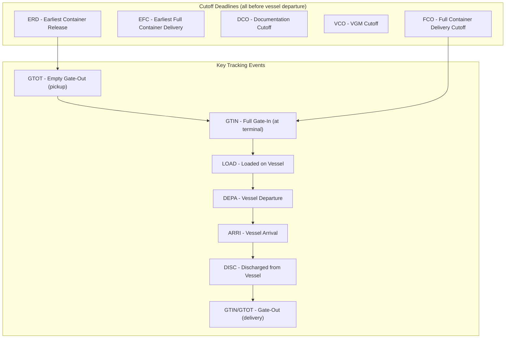

# Container Shipping 101

A primer on how containerized ocean shipping works -- from the physical journey of cargo to the documents, terms, and economics that govern it. Written for technically-minded readers evaluating product opportunities in carrier API integrations.

---

## Table of Contents

1. [Industry Scale](#industry-scale)
2. [The End-to-End Supply Chain](#the-end-to-end-supply-chain)
3. [Key Physical Infrastructure](#key-physical-infrastructure)
4. [Container Types and Sizes](#container-types-and-sizes)
5. [FCL vs. LCL](#fcl-vs-lcl)
6. [The Voyage Lifecycle](#the-voyage-lifecycle)
7. [Key Documents](#key-documents)
8. [Incoterms](#incoterms)
9. [Transshipment](#transshipment)
10. [Demurrage and Detention](#demurrage-and-detention)
11. [The Regulatory Environment](#the-regulatory-environment)
12. [Sources](#sources)

---

## Industry Scale

Global container shipping is the circulatory system of world trade. In 2025, roughly **193 million TEUs** (twenty-foot equivalent units -- the standard measure of container volume) moved across the world's oceans, up from 184 million in 2024. As of early 2026, the global fleet consists of approximately 7,500 container vessels with a combined capacity of 33.7 million TEUs.

### Major Trade Lanes

| Trade Lane | Annual Volume (approx.) | Notes |
|---|---|---|
| **Intra-Asia** | ~43.5M TEUs | Largest lane globally; doubled the size of the next largest in 2025 |
| **Asia to North America (Transpacific)** | ~22M TEUs | Heavily affected by US-China tariff dynamics |
| **Asia to Europe** | ~19.6M TEUs | Disrupted by Red Sea security concerns; many ships rerouting via Cape of Good Hope, adding 7-14 days |
| **North America to Asia** | ~8.4M TEUs | Significant backhaul lane |
| **Europe to North America (Transatlantic)** | ~5-6M TEUs | Smaller but steady |

### Seasonal Patterns

Container shipping has a pronounced annual rhythm. Peak season typically runs from **July through October** as retailers stock up for the holiday season in North American and European markets. Chinese New Year (January/February) creates a pre-holiday surge followed by a manufacturing lull. Agricultural export seasons in South America and Oceania create regional peaks.

The 2026 outlook calls for roughly 3% demand growth against 3.6% fleet capacity expansion -- a shipper-favorable market with expected freight rate declines of 10-25%.

---

## The End-to-End Supply Chain

The following diagram traces the physical journey of containerized cargo from manufacturer to final delivery:

```mermaid
flowchart LR
    subgraph Origin
        A[Manufacturer / Shipper] --> B[Container Stuffing<br>at Factory or CFS]
        B --> C[Trucking to<br>Origin Terminal]
    end

    subgraph Origin Port
        C --> D[Terminal Gate-In]
        D --> E[Container Yard<br>Storage]
        E --> F[Loaded onto Vessel<br>by STS Crane]
    end

    subgraph Ocean Transit
        F --> G[Ocean Voyage]
        G --> H{Transshipment<br>Required?}
        H -- Yes --> I[Discharge at<br>Hub Port]
        I --> J[Reload onto<br>Feeder Vessel]
        J --> K[Feeder Voyage]
        H -- No --> K
    end

    subgraph Destination Port
        K --> L[Vessel Arrival &<br>Discharge]
        L --> M[Container Yard<br>Storage]
        M --> N[Customs Clearance]
        N --> O[Terminal Gate-Out]
    end

    subgraph Inland Delivery
        O --> P[Truck or Rail<br>to Destination]
        P --> Q[Container Unstuffed<br>at Warehouse / CFS]
        Q --> R[Empty Container<br>Returned to Depot]
    end
```



This is a simplified view. In reality, each handoff involves documentation, coordination between multiple parties (shipper, freight forwarder, customs broker, carrier, terminal operator, trucker, consignee), and increasingly, API-driven data exchange.

---

## Key Physical Infrastructure

### Ports and Terminals

A **port** is a geographic location with one or more **terminals** -- the actual facilities where ships berth and containers are handled. Major container ports include Shanghai (the world's busiest by TEU throughput), Singapore, Busan, Rotterdam, and Los Angeles/Long Beach. A single port may have multiple terminals operated by different companies (e.g., APM Terminals, PSA International, DP World).

### Terminal Layout

A container terminal has several functional zones:

| Zone | Function |
|---|---|
| **Berth / Quay** | Where vessels dock. Equipped with Ship-to-Shore (STS) gantry cranes that lift containers between ship and shore. A large STS crane can move 30-40 containers per hour. |
| **Container Yard (CY)** | The main storage area where containers are stacked (typically 4-5 high) while awaiting loading or pickup after discharge. Managed by Rubber-Tired Gantry (RTG) or Rail-Mounted Gantry (RMG) cranes. |
| **Container Freight Station (CFS)** | A warehouse within or near the terminal where LCL cargo is consolidated (stuffed into containers) or deconsolidated (stripped from containers). |
| **Gate** | The truck entrance/exit. Containers are inspected, weighed, and their seal numbers verified at the gate. This is where "gate-in" and "gate-out" events are recorded -- key tracking milestones. |
| **Intermodal Yard** | Rail connections for moving containers to/from inland destinations. Containers are transferred between truck chassis and rail cars. |

### Inland Infrastructure

- **Inland Container Depots (ICDs):** Dry ports that function as extensions of seaports, typically located near manufacturing centers. Containers can be customs-cleared here rather than at the congested seaport.
- **Container Depots:** Facilities where empty containers are stored, inspected, repaired, and redistributed. Managing empty container repositioning is one of the industry's largest logistics challenges.
- **Rail Corridors:** Long-haul rail moves containers between ports and inland markets (e.g., the US Class I railroad network connecting West Coast ports to the Midwest and East Coast).

---

## Container Types and Sizes

The intermodal shipping container is the fundamental unit of containerized trade. All containers conform to ISO 668 dimensional standards, meaning any container can be handled by any crane, carried on any vessel, stacked on any chassis, and loaded on any rail car worldwide.

### Standard Container Dimensions

| Type | External Dimensions (L x W x H) | Internal Volume | Max Payload | Common Use |
|---|---|---|---|---|
| **20' Standard (TEU)** | 20' x 8' x 8'6" | ~33 m3 | ~21,700 kg | Dense/heavy cargo (machinery, raw materials). The baseline unit of measurement. |
| **40' Standard (FEU)** | 40' x 8' x 8'6" | ~67 m3 | ~26,500 kg | General merchandise, consumer goods. Most common container in service. |
| **40' High Cube (HC)** | 40' x 8' x 9'6" | ~76 m3 | ~26,200 kg | Voluminous/light cargo (furniture, electronics packaging). The extra foot of height is significant. |

### Specialized Container Types

| Type | Key Feature | Typical Cargo |
|---|---|---|
| **Reefer (Refrigerated)** | Built-in refrigeration unit, temperature range -40C to +30C, requires electrical power connection on vessel/terminal | Perishable food (produce, meat, seafood), pharmaceuticals, chemicals |
| **Open Top** | No solid roof; covered by removable tarpaulin | Over-height cargo that must be loaded by crane from above (machinery, timber, large equipment) |
| **Flat Rack** | No sidewalls or roof; collapsible end walls | Oversized and heavy cargo (vehicles, boats, industrial equipment, construction materials). Can carry up to 50,000 kg on a 40' unit |
| **Tank Container** | Cylindrical stainless steel vessel inside standard ISO frame | Bulk liquids, gases, and powders (chemicals, food-grade liquids, wine) |

The TEU is the universal currency of container shipping. When the industry says "193 million TEUs moved in 2025," a single 40' container counts as 2 TEUs.

---

## FCL vs. LCL

This distinction drives how cargo is priced, routed, and physically handled.

**FCL (Full Container Load):** One shipper books an entire container for exclusive use. The container is loaded ("stuffed") at the shipper's premises or a nominated facility, sealed, and transported end-to-end without being opened until it reaches the consignee. Priced as a flat rate per container regardless of how full it is.

**LCL (Less than Container Load):** Multiple shippers' cargo is consolidated into a single shared container. A freight forwarder or NVOCC (Non-Vessel Operating Common Carrier) acts as the consolidator. Cargo is delivered to a Container Freight Station (CFS), combined with other shipments headed to the same destination region, and loaded into a container. At the destination CFS, the container is deconsolidated and individual shipments are distributed.

### Comparison

| Factor | FCL | LCL |
|---|---|---|
| **Pricing** | Flat rate per container | Per cubic meter (CBM) or per metric ton, whichever is greater |
| **Cost breakeven** | Generally cheaper above ~15 CBM | Generally cheaper below ~15 CBM |
| **Transit time** | Faster (direct, fewer handoffs) | Slower (+3-7 days for CFS consolidation/deconsolidation at each end) |
| **Handling risk** | Lower (sealed at origin, opened at destination) | Higher (more handling touchpoints, cargo from multiple shippers) |
| **Minimum shipment** | You pay for the whole container even if it's half full | As little as 1 CBM |
| **Tracking complexity** | Simpler (one container = one shipment) | More complex (one container = many shipments; individual tracking requires CFS-level visibility) |

This matters for API integration because FCL shipments map cleanly to a single container/booking, while LCL shipments require tracking at the CFS consolidation level -- a layer that most carrier APIs do not expose.

---

## The Voyage Lifecycle

A containerized shipment moves through a well-defined sequence of stages, each generating data events that carrier APIs expose (or should expose):

### 1. Booking

The shipper or their freight forwarder requests space on a specific vessel sailing. The carrier confirms with a **booking number**, vessel/voyage details, and critical cutoff dates. This is where the digital paper trail begins.

### 2. Documentation

Before the container can be loaded, several documents must be submitted to the carrier:
- **Shipping Instructions (SI):** The data package the carrier needs to issue a Bill of Lading -- shipper/consignee details, cargo description, weights, marks and numbers.
- **VGM Declaration:** The verified gross mass of the packed container (a mandatory SOLAS requirement).
- **Customs filings:** AMS/ISF for US-bound cargo (see [Regulatory Environment](#the-regulatory-environment)).

Each document has a **cutoff deadline**. Miss it and the container gets "rolled" to the next sailing -- a costly delay.

### 3. Container Pickup and Stuffing

The shipper (or their trucker) collects an empty container from a depot or terminal. This generates an **Empty Container Gate-Out (GTOT)** event. The container is transported to the shipper's facility or a CFS, where cargo is loaded ("stuffed"), secured with dunnage, and the container is sealed with a tamper-evident seal.

### 4. Delivery to Terminal

The loaded container is trucked to the origin terminal before the **FCL Delivery Cutoff (FCO)**. When it passes through the terminal gate, a **Full Container Gate-In (GTIN)** event is recorded. The container enters the yard and waits for its vessel.

### 5. Loading

Ship-to-Shore cranes load containers from the yard onto the vessel according to a carefully calculated stow plan (which accounts for weight distribution, port rotation, reefer power positions, and hazardous cargo segregation). A **Container Loaded (LOAD)** event is generated. This is a critical milestone -- it triggers Bill of Lading issuance and confirms the cargo is physically on board.

### 6. Ocean Transit

The vessel sails its rotation, calling at multiple ports. During transit, carriers provide **Vessel Departure (DEPA)** and **Vessel Arrival (ARRI)** events for each port call. GPS-based vessel tracking provides real-time position data, but container-level status depends on carrier systems.

### 7. Discharge

At the destination port (or a transshipment hub), STS cranes unload the container. A **Container Discharged (DISC)** event is recorded. The container moves to the import yard.

### 8. Customs Clearance and Delivery

The consignee (or their customs broker) clears the cargo through import customs. Once released, the container is picked up from the terminal -- generating a **Full Container Gate-Out** event -- and transported to the consignee's facility for unstuffing. The empty container is then returned to a designated depot.



Every one of these events has a **classifier** indicating whether it is **Planned (PLN)**, **Estimated (EST)**, or **Actual (ACT)** -- a distinction that is central to the DCSA Track and Trace standard and critical for building useful tracking products.

---

## Key Documents

### Bill of Lading (B/L)

The single most important document in ocean shipping. It serves three simultaneous functions:

1. **Receipt of goods** -- the carrier acknowledges receiving the cargo in described condition
2. **Contract of carriage** -- evidence of the transportation agreement
3. **Document of title** -- whoever holds the original B/L has the right to claim the cargo

There are two main variants:

| Type | Negotiable? | Ownership Transfer | Use Case |
|---|---|---|---|
| **Negotiable B/L (Order B/L)** | Yes | Can be endorsed and transferred; goods released to holder of original | Trade finance (letters of credit), cargo sold in transit |
| **Sea Waybill (SWB)** | No | Named consignee only; no original required for release | Trusted trading partners, intra-company shipments, speed of release |

The industry is slowly moving toward **electronic Bills of Lading (eBL)**, with DCSA targeting full adoption by 2030. The DCSA Bill of Lading 3.0 standard was launched in 2025.

### Other Key Documents

| Document | Purpose | Who Produces It |
|---|---|---|
| **Commercial Invoice** | Declares the value of goods for customs and payment purposes | Seller/shipper |
| **Packing List** | Itemizes the contents, quantities, weights, and dimensions of each package in the shipment | Seller/shipper |
| **Certificate of Origin** | Certifies the country of manufacture; determines applicable tariff rates and trade agreement eligibility | Chamber of commerce or authorized body |
| **Customs Declaration** | Required by import/export authorities to assess duties, taxes, and admissibility | Customs broker or importer/exporter |
| **Shipping Instructions (SI)** | Data submitted to the carrier to generate the Bill of Lading | Shipper or freight forwarder |

---

## Incoterms

Incoterms (International Commercial Terms) are standardized three-letter codes published by the International Chamber of Commerce (ICC) that define **who pays for what** and **who bears the risk** at each point in the shipment journey. The current version is Incoterms 2020.

This matters because an Incoterm determines which party -- buyer or seller -- is responsible for arranging transport, paying freight, buying insurance, handling customs clearance, and bearing the risk of loss or damage at each stage.

### Most Common Incoterms in Container Shipping

| Term | Full Name | Seller Responsible For | Risk Transfers When | Common Usage |
|---|---|---|---|---|
| **EXW** | Ex Works | Making goods available at their premises. Nothing else. | At seller's premises | Minimal seller obligation. Buyer arranges everything. Rarely used for international ocean freight in practice. |
| **FOB** | Free on Board | Export customs, delivery to port, loading onto vessel | Goods are on board the vessel at origin port | The most common Incoterm in ocean shipping. Buyer nominates the vessel and pays ocean freight. |
| **CIF** | Cost, Insurance, Freight | Everything FOB covers plus ocean freight and minimum insurance to destination port | Same as FOB (on board at origin) -- but seller pays freight | Common in commodity trades. Note: risk transfers at origin even though seller pays to destination. |
| **FCA** | Free Carrier | Delivery to a named place (often a CFS or terminal) and export customs | At the named delivery point | Actually more appropriate than FOB for containerized cargo, since containers are often handed to the carrier at a CFS before loading. |
| **DDP** | Delivered Duty Paid | Everything: transport, insurance, import customs, duties, delivery to buyer's premises | At buyer's premises | Maximum seller obligation. Seller handles all logistics and customs in both countries. |
| **DAP** | Delivered at Place | Transport and insurance to a named destination, but not import customs/duties | At the named destination, before unloading | Seller handles logistics but buyer handles import formalities. |

A key nuance: **FOB and CIF are technically only for non-containerized (breakbulk) cargo** under Incoterms 2020 rules, because risk transfers "on board the vessel" -- but for containers, the cargo is handed to the carrier at a terminal long before it's physically on the vessel. FCA is the technically correct alternative for containers. Despite this, FOB remains the dominant term used in practice for container shipping. The industry largely ignores the ICC's recommendation here.

---

## Transshipment

A **transshipment** occurs when a container is unloaded from one vessel at an intermediate port and loaded onto a different vessel to continue its journey. This is the norm, not the exception -- the majority of global container movements involve at least one transshipment.

### Why Transshipment Exists

Ocean carriers operate **hub-and-spoke networks**. Large, fuel-efficient vessels (14,000-24,000 TEU mega-ships) sail mainline routes between major hub ports. Smaller feeder vessels connect regional spoke ports to these hubs. This is more economical than running direct services between every possible origin-destination pair.

### Major Transshipment Hubs

| Hub | Region | Transshipment Share | Notes |
|---|---|---|---|
| **Singapore** | Southeast Asia | ~85% of traffic | World's largest transshipment hub (~35M TEUs); strategic location on the Strait of Malacca |
| **Tanjung Pelepas** | Malaysia | ~95% | Competes directly with Singapore |
| **Tanger Med** | Morocco | ~90% | Gateway between Atlantic and Mediterranean |
| **Colombo** | Sri Lanka | ~75% | Key hub for Indian Subcontinent traffic |
| **Busan** | South Korea | ~50% | Northeast Asia hub |
| **Port Klang** | Malaysia | ~60% | Secondary Southeast Asia hub |

### Why This Matters for Tracking

Transshipment is the biggest source of tracking complexity. When a container changes vessels at a hub port, there is a gap in visibility: the container is discharged from vessel A, sits in the hub terminal's yard (potentially for days), and is eventually loaded onto vessel B. During this time:

- The container may be assigned to a different vessel than originally planned
- Vessel B may be operated by a different carrier (under a vessel-sharing agreement)
- The tracking events come from the hub terminal's systems, not the carrier's
- Feeder vessel tracking is often less granular than mainline vessel tracking

For anyone building tracking products, robust transshipment handling is table stakes. A single shipment from a factory in Vietnam to a warehouse in Ohio might involve: truck to Ho Chi Minh City terminal, feeder to Singapore, mainline vessel to Los Angeles, rail to Chicago, truck to final destination -- touching four or five different carriers and operators.

---

## Demurrage and Detention

These are penalty charges that represent one of the biggest cost pain points for freight forwarders and shippers. Understanding them is essential for anyone building logistics products.

**Demurrage** is charged when a full container stays at the **port terminal** beyond its allotted free time after discharge. The terminal (or carrier) charges the consignee for occupying valuable yard space.

**Detention** is charged when a container stays in the **consignee's possession** beyond the allotted free time after pickup. The carrier charges for tying up their equipment (the container itself).

### How the Charges Work

```
Container discharged at port
       |
       v
  [Free Time: typically 5-7 days for demurrage]
       |
       v
  Demurrage charges begin ($150-$400+/day, escalating)
       |
  Container picked up from terminal
       |
       v
  [Free Time: typically 2-4 days for detention]
       |
       v
  Detention charges begin
       |
  Empty container returned to depot
```

### Why This Matters

- Rates typically **escalate** -- $150/day for the first few days, $300-400+ after day 7
- Maersk updated US detention/demurrage tariffs effective January 2026, increasing charges by $20-40 per container type at multiple ports
- Carriers have been reducing free time allowances in congested ports
- Studies show that automated tracking alerts can reduce D&D charges by 25-40%
- For an NVOCC/freight forwarder like SSL, D&D charges can erode margins rapidly if not monitored proactively

This is one of the clearest product opportunities in carrier API integration: real-time visibility into free time windows, automated alerts before expiry, and dashboards that give operations teams early warning to prioritize container pickups and returns.

---

## The Regulatory Environment

Container shipping operates within a web of international and national regulations. Here are the most significant ones:

### SOLAS VGM (Verified Gross Mass)

Since July 2016, the International Maritime Organization (IMO) requires that every packed container must have a **verified gross mass** submitted to the carrier and terminal before it can be loaded onto a vessel. The shipper is legally responsible for providing this declaration. Without a VGM submission, the container will not be loaded -- full stop. This regulation was introduced after investigations revealed that misdeclared container weights were a contributing factor in vessel stability incidents.

### ISF / AMS (US-Specific)

**AMS (Automated Manifest System):** Filed by the **carrier**. For ocean cargo, manifest data must be transmitted to US Customs and Border Protection (CBP) at least **24 hours before departure** from the foreign port.

**ISF (Importer Security Filing / "10+2"):** Filed by the **importer** (or their customs broker). Requires 10 data elements from the importer and 2 from the carrier, submitted at least **24 hours before loading** at the foreign port. Penalties for late or inaccurate filing: $5,000-$10,000 per violation.

### Customs (Import/Export)

Every country has its own customs regime. In general:
- **Export customs** must be cleared at the origin country before the container can be loaded
- **Import customs** must be cleared at the destination country before the container can be released from the terminal
- Customs declarations include cargo description, value, harmonized system (HS) codes, origin, and supporting documents

### Hague-Visby Rules

The international convention governing carrier liability for cargo loss or damage during ocean transport. Key provision: carrier liability is limited to approximately **$2 per kilogram** of gross weight or **$830 per package** (SDR-based), whichever is higher. This is why cargo insurance beyond the carrier's liability is standard practice.

### DCSA Standards

The **Digital Container Shipping Association** is an industry body (founded by major carriers including Maersk, MSC, CMA CGM, and Hapag-Lloyd) working to standardize digital interfaces. Their Track and Trace standard supports over 180 million monthly container tracking events covering 75% of global container shipping volume. The Port of Rotterdam became the first major port to implement the DCSA T&T standard in its port community system in 2025. For anyone building integrations, DCSA-compliant carriers offer standardized API interfaces -- a significant advantage over proprietary APIs.

---

## Sources

- [Vizion API - Global Container Trade: 2025 Performance Review and 2026 Forecasts](https://www.vizionapi.com/blog/global-container-trade-2025-performance-review-and-2026-forecasts)
- [Maritime Fairtrade - 2025: A Record-Breaking Year for Global Container Volumes](https://maritimefairtrade.org/2025-a-record-breaking-year-for-global-container-volumes/)
- [FreightWaves - Despite U.S. Decline, Global Container Traffic Sets New Record](https://www.freightwaves.com/news/despite-u-s-decline-global-container-traffic-sets-new-record)
- [Container Trades Statistics - December 2025 Press Release](https://containerstatistics.com/december-2025-press-release/)
- [STU Supply Chain - 2026 Global Container Liner Capacity Review](https://stusupplychain.com/2026-global-container-liner-capacity-review.html)
- [SEKO Logistics - Asia-Europe Trade Lane Guide 2026](https://www.sekologistics.com/en/resource-hub/knowledge-hub/asia-europe-trade-lane-guide-mastering-the-worlds-largest-shipping-corridor-in-2025/)
- [SEKO Logistics - Transpacific Trade Lane Guide 2026](https://www.sekologistics.com/en/resource-hub/knowledge-hub/transpacific-trade-lane-guide-navigating-asia-to-north-america-shipping-in-2025/)
- [Hapag-Lloyd - Understanding the Hub & Spoke System in Container Shipping](https://www.hapag-lloyd.com/en/online-business/digital-insights-dock/insights/2024/10/understanding-the-hub-spoke-system-in-container-shipping-.html)
- [Global Maritime Hub - Transhipment Hubs Drive Growth in Global Port Volumes in 2025](https://globalmaritimehub.com/transhipment-hubs-drive-growth-in-global-port-volumes-in-2025.html)
- [DCSA - Track & Trace Standard Ready for Use in the Port of Rotterdam](https://dcsa.org/newsroom/track-trace-ready-for-use-in-port-of-rotterdam)
- [DCSA - Bill of Lading vs Sea Waybill](https://dcsa.org/newsroom/sea-waybill-vs-bill-of-lading)
- [Maersk - What is Demurrage and Detention in Shipping](https://www.maersk.com/logistics-explained/transportation-and-freight/2023/08/28/what-is-demurrage-detention-in-shipping-for-buyers)
- [Maersk - Changes to US Detention & Demurrage Tariffs (Dec 2025)](https://www.maersk.com/news/articles/2025/12/02/changes-to-us-detention-demurrage-tariff)
- [Vizion API - Demurrage vs Detention vs Per Diem Guide](https://www.vizionapi.com/blog/detention-vs-demurrage-vs-per-diem-a-guide-to-container-freight-charges-fees)
- [Maersk - Sea Waybill vs Bill of Lading](https://www.maersk.com/logistics-explained/shipping-documentation/2023/10/03/difference-bill-of-lading-sea-waybill)
- [IMO - Verification of the Gross Mass of a Packed Container](https://www.imo.org/en/ourwork/safety/pages/verification-of-the-gross-mass.aspx)
- [Maersk - Verified Gross Mass (VGM)](https://www.maersk.com/transportation-services/verified-gross-mass)
- [US Trade.gov - Know Your Incoterms](https://www.trade.gov/know-your-incoterms)
- [IncoDocs - Incoterms Guide 2025](https://incodocs.com/blog/incoterms-2020-explained-the-complete-guide/)
- [iCustoms - AMS, ISF & ACAS Filing Guide](https://www.icustoms.ai/blogs/ams-isf-acas-us-customs-filing-compliance/)
- [Maersk - Container Stuffing 101](https://www.maersk.com/logistics-explained/transportation-and-freight/2024/07/12/container-stuffing)
- [Port Economics, Management and Policy - Container Terminal Design and Equipment](https://porteconomicsmanagement.org/pemp/contents/part6/container-terminal-design-equipment/)
- [DP World - FCL vs LCL Shipping](https://www.dpworld.com/en/insights/fcl-vs-lcl-which-shipping-option-saves-you-more-money)
