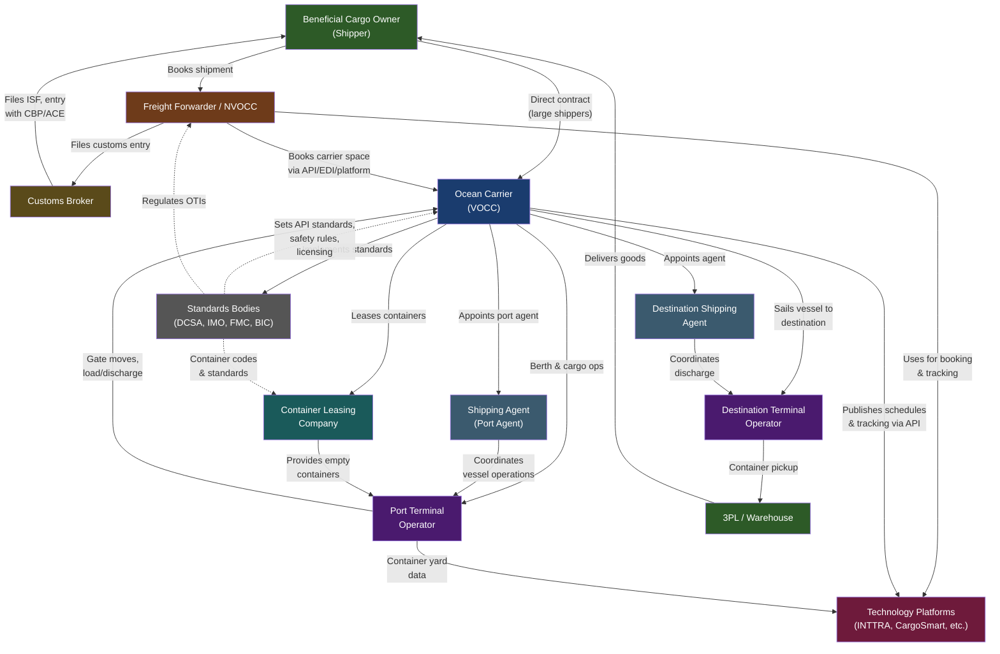

# The Containerized Shipping Ecosystem: Players and Roles

A guide to every type of entity in the containerized ocean shipping ecosystem -- who they are, what they do, how they make money, and what technology they depend on. Written for a technically-minded audience with zero prior shipping knowledge.

---

## Table of Contents

1. [Ocean Carriers](#1-ocean-carriers)
2. [NVOCCs and Freight Forwarders](#2-nvoccs-and-freight-forwarders)
3. [Third-Party Logistics Providers (3PLs)](#3-third-party-logistics-providers-3pls)
4. [Beneficial Cargo Owners (BCOs)](#4-beneficial-cargo-owners-bcos)
5. [Customs Brokers](#5-customs-brokers)
6. [Port Terminal Operators](#6-port-terminal-operators)
7. [Shipping Agents](#7-shipping-agents)
8. [Container Leasing Companies](#8-container-leasing-companies)
9. [Industry Standards Bodies](#9-industry-standards-bodies)
10. [Technology Intermediaries](#10-technology-intermediaries)
11. [Ecosystem Map](#11-ecosystem-map)

---

## 1. Ocean Carriers

Ocean carriers (also called vessel-operating common carriers, or VOCCs) are the companies that own or charter the container ships. They are the physical backbone of global trade: without them, nothing moves. A single ultra-large container vessel (ULCV) can carry over 24,000 TEU (twenty-foot equivalent units -- the standard container measurement), representing roughly $1 billion worth of cargo per sailing.

### Business Model

Carriers sell space on their vessels. Revenue comes in two forms:

- **Contract rates**: Long-term agreements (typically annual) with large shippers or forwarders guaranteeing a fixed price per container on a given trade lane. These provide revenue predictability but lock the carrier into a rate that may be above or below market by the time the container actually ships.
- **Spot rates**: One-off bookings at current market prices. Spot rates are volatile -- during the 2021-2022 pandemic surge, Asia-to-US-West-Coast spot rates peaked above $20,000/FEU (forty-foot equivalent unit), compared to a historical norm of $1,500-2,500.

Carriers also earn from surcharges (fuel/bunker adjustment factors, peak season surcharges, congestion surcharges) and ancillary services (demurrage and detention fees, documentation fees, reefer monitoring).

### The Alliance System

Individual carriers cannot profitably serve every trade lane with sufficient frequency. Alliances allow carriers to share vessel capacity on major routes, offering customers broader coverage without each member deploying its own ships on every lane. As of February 2025, the alliance landscape restructured significantly:

| Alliance | Members | Combined Capacity | Market Share | Notes |
|---|---|---|---|---|
| **Independent (MSC)** | MSC | ~6,768,000 TEU | ~20.8% | Operates solo after the 2M alliance with Maersk ended Jan 2025 |
| **Gemini Cooperation** | Maersk, Hapag-Lloyd | ~6,746,000 TEU | ~20.7% | New alliance launched Feb 2025. Uses a hub-and-spoke model targeting 90% schedule reliability (industry average is ~55%) |
| **Ocean Alliance** | CMA CGM, COSCO, OOCL, Evergreen | ~8,910,000 TEU | ~29% | Continuation of existing alliance, locked in through 2032 |
| **Premier Alliance** | ONE, HMM, Yang Ming | ~3,574,000 TEU | ~11% | Formerly THE Alliance; lost Hapag-Lloyd to Gemini |

MSC's decision to operate independently -- backed by an aggressive orderbook of 133 new vessels -- makes it the largest single carrier by capacity on the planet. The top 10 carriers collectively control approximately 84.6% of global container fleet capacity (~32.5 million TEU total).

### Top 10 Carriers by Capacity (2025-2026)

| Rank | Carrier | SCAC | Headquarters | Capacity (TEU) | Market Share |
|---|---|---|---|---|---|
| 1 | Mediterranean Shipping Company (MSC) | MSCU | Geneva, Switzerland | 6,768,227 | 20.8% |
| 2 | Maersk | MAEU | Copenhagen, Denmark | 4,619,020 | 14.2% |
| 3 | CMA CGM | CMDU | Marseille, France | ~4,000,000+ | ~12.3% |
| 4 | COSCO Shipping | COSU | Shanghai, China | ~3,400,000 | ~10.5% |
| 5 | Hapag-Lloyd | HLCU | Hamburg, Germany | ~2,100,000 | ~6.5% |
| 6 | Ocean Network Express (ONE) | ONEY | Singapore | 2,091,988 | 6.4% |
| 7 | Evergreen Marine | EGLV | Taipei, Taiwan | 1,858,308 | 5.7% |
| 8 | HMM (Hyundai Merchant Marine) | HDMU | Seoul, South Korea | 941,019 | 2.9% |
| 9 | ZIM | ZIMU | Haifa, Israel | 761,715 | 2.3% |
| 10 | Yang Ming | YMLU | Keelung, Taiwan | 726,031 | 2.2% |

### Technology Posture

Carriers operate complex internal systems: terminal operating systems (TOS), vessel stowage planning software, equipment tracking, booking platforms, and EDI (Electronic Data Interchange) connections with partners. Externally, most major carriers now expose APIs for tracking, booking, and schedules -- increasingly aligned with DCSA standards (see [Section 9](#9-industry-standards-bodies)). However, the quality and completeness of these APIs varies enormously. Some carriers still rely heavily on EDI messages (IFTMIN, IFTSTA, COPARN) and even manual processes for key operations.

---

## 2. NVOCCs and Freight Forwarders

These are the intermediaries between the people who own cargo (shippers) and the carriers who move it. In the US, both are regulated by the Federal Maritime Commission (FMC) as "Ocean Transportation Intermediaries" (OTIs), but they serve distinct legal functions.

### NVOCC (Non-Vessel-Operating Common Carrier)

An NVOCC is legally an ocean carrier -- it issues its own bills of lading and accepts liability for cargo -- but it does not own or operate any ships. Instead, it buys container slots from VOCCs at negotiated rates and resells that capacity to shippers, often consolidating less-than-container-load (LCL) shipments from multiple customers into full containers.

- **FMC financial responsibility requirement**: $75,000 (US-based), $150,000 (foreign-registered).
- **Key differentiator**: Issues a house bill of lading (HBL). The VOCC sees the NVOCC as its customer, not the actual shipper.

### Ocean Freight Forwarder (OFF)

A freight forwarder arranges transportation but does not assume carrier liability. It acts as an agent of the shipper -- booking space, preparing documentation, coordinating inland transport, and managing the logistics chain. A forwarder does not issue its own bill of lading.

- **FMC financial responsibility requirement**: $50,000.
- **Key differentiator**: Acts as the shipper's agent, not as a carrier.

Many companies hold both licenses, allowing them to act as an NVOCC on some shipments and a forwarder on others depending on what the customer needs. Sea Shipping Line (SSL), the client for the steamship-integrations project, is a federally licensed NVOCC.

### Scale Spectrum

The freight forwarding industry spans an enormous range:

| Tier | Examples | Annual Revenue | Ocean TEU Volume |
|---|---|---|---|
| Global giants | DSV (incl. Schenker), DHL Global Forwarding, Kuehne+Nagel, Sinotrans | $20-43B+ | 2-5M+ TEU |
| Large forwarders | Flexport, Expeditors, C.H. Robinson, Bolloré Logistics | $1-10B | 100K-1M TEU |
| Mid-market | Regional specialists, niche commodity forwarders | $10M-1B | 10K-100K TEU |
| Small operators | 1-10 person shops, often specializing in a single trade lane | <$10M | <10K TEU |

DSV completed its acquisition of DB Schenker in April 2025 for EUR 14.3 billion, creating the world's largest freight forwarder by revenue at approximately $43.5 billion. In ocean freight specifically, Sinotrans claimed the number one global position in 2025 with 4.87 million TEU, surpassing Kuehne+Nagel at 4.31 million TEU.

### Technology Needs

Forwarders and NVOCCs need:

- **Rate management**: Comparing carrier rates across trade lanes, managing contract vs. spot pricing.
- **Booking and documentation**: Submitting bookings to carriers, generating bills of lading, managing shipping instructions.
- **Tracking and visibility**: Real-time container tracking across multiple carriers -- this is precisely what the steamship-integrations SDK addresses.
- **Customs and compliance**: Filing ISF (Importer Security Filing), managing AMS (Automated Manifest System) data.
- **TMS (Transportation Management System)**: Core operational system for managing shipments end-to-end. Examples: CargoWise (WiseTech Global), Magaya, Descartes.

---

## 3. Third-Party Logistics Providers (3PLs)

A 3PL is a broader category than a freight forwarder. While forwarders focus on arranging transportation, 3PLs may also manage warehousing, fulfillment, inventory, trucking, and the full supply chain on behalf of their clients.

### Scope of Services

| Service | Freight Forwarder | 3PL |
|---|---|---|
| Ocean freight booking | Yes | Sometimes |
| Customs clearance | Sometimes | Often |
| Warehousing / distribution | Rarely | Core offering |
| Inventory management | No | Often |
| Order fulfillment | No | Often |
| Last-mile delivery | No | Sometimes |
| Drayage (port-to-warehouse trucking) | Sometimes | Often |
| Supply chain consulting | Rarely | Often |

The 3PL market is massive -- projected at $1.32 trillion globally in 2025, growing at approximately 10% CAGR. The largest 3PLs include DHL Supply Chain, XPO Logistics, C.H. Robinson, J.B. Hunt, and Ryder. Many of the companies listed as freight forwarders also operate 3PL divisions, making the boundary fuzzy in practice.

### Business Model

3PLs charge for the services they perform: per-pallet warehousing fees, per-order fulfillment charges, and margin on transportation they arrange. The value proposition is allowing shippers to outsource logistics complexity rather than building in-house infrastructure and expertise.

### Technology Posture

3PLs are heavy users of warehouse management systems (WMS), order management systems (OMS), and transportation management systems (TMS). They need integration touchpoints with carrier tracking APIs, customs filing systems, and their clients' ERP/order systems. Many 3PLs operate proprietary visibility portals that aggregate tracking data from multiple carriers -- consuming exactly the kind of normalized data that a unified tracking SDK produces.

---

## 4. Beneficial Cargo Owners (BCOs)

BCOs are the companies that actually own the goods being shipped. They are the ultimate source of demand in the entire ecosystem. If Nike needs to move 50,000 TEU of shoes from Vietnam to the United States each year, Nike is the BCO.

### Contracting Models

BCOs have two main options for moving their cargo:

- **Direct carrier contracts**: Large BCOs (typically 100+ TEU annually on a given trade lane) negotiate service contracts directly with VOCCs. This typically saves 10-25% compared to forwarder rates but requires volume commitments and dedicated logistics staff.
- **Through a forwarder/NVOCC**: Smaller or less logistics-savvy BCOs hire intermediaries to handle everything. The BCO pays a single price; the forwarder manages the carrier relationships.

Many large BCOs use a hybrid model: direct contracts for their core, high-volume lanes, and forwarders for overflow, seasonal surges, or trade lanes where they lack volume to negotiate favorable rates.

### Who Are They?

Any company that imports or exports goods by sea: retailers (Walmart, Target, Amazon), manufacturers (Samsung, LG), agricultural exporters, commodity traders, automotive companies, and more. In the US, the top 100 importers account for a disproportionate share of ocean container volume.

### Technology Needs

BCOs need **supply chain visibility** above all else. They want to know: where is my container, when will it arrive, and has anything changed? They also need demand forecasting integration, purchase order management, and increasingly, carbon emissions tracking for ESG reporting. Large BCOs often run SAP, Oracle, or similar ERP systems and need carrier data to flow into those platforms.

---

## 5. Customs Brokers

A customs broker is a licensed specialist who handles customs clearance -- the process of getting goods legally through a country's border. In the US, customs brokers are licensed by US Customs and Border Protection (CBP) after passing a rigorous examination. There are approximately 14,454 active licensed customs brokers in the US.

### What They Do

- Classify goods using the Harmonized Tariff Schedule (HTS) codes
- Calculate duties, taxes, and fees
- File entry documents with CBP electronically via the Automated Commercial Environment (ACE)
- File the Importer Security Filing (ISF or "10+2") at least 24 hours before vessel departure for ocean shipments
- Handle exams, holds, and compliance issues
- Manage bonded warehouse entries, Foreign Trade Zone (FTZ) operations, and duty drawback claims

### Relationship to Forwarders

Many freight forwarding companies also hold customs broker licenses, offering both services under one roof. This is convenient for shippers but the two functions are legally distinct. A customs broker's fiduciary duty is to ensure compliance with customs law -- sometimes that creates tension with the forwarder's commercial interest in moving cargo quickly.

### Technology Posture

Customs brokers work primarily through CBP's ACE (Automated Commercial Environment) system and use customs brokerage software like CargoWise, Descartes CustomsInfo, or US Customs Clearance. They receive data from carriers (arrival notices, manifest information) and shippers (commercial invoices, packing lists) and need it in structured formats for filing.

---

## 6. Port Terminal Operators

Terminal operators manage the physical port facilities where containers are loaded onto and unloaded from vessels. They operate the cranes, manage the container yard, run the truck gates, and coordinate with railroads for intermodal connections.

### Major Operators

| Operator | Headquarters | Notable Facts |
|---|---|---|
| **PSA International** | Singapore | World's largest terminal operator; handled a record 105M TEU in 2025 |
| **APM Terminals** | The Hague, Netherlands | Subsidiary of Maersk; 39.4% EBIT margin in Q3 2025 |
| **China Merchants Ports** | Hong Kong | Major presence across Chinese ports |
| **COSCO Shipping Ports** | Hong Kong | Terminal arm of COSCO Shipping Group |
| **DP World** | Dubai, UAE | Global portfolio spanning 60+ terminals; $11.24B revenue H1 2025 |
| **Hutchison Ports** | Hong Kong | One of the earliest global terminal operators |
| **MSC Group (TiL)** | Geneva, Switzerland | Terminal Investments Limited, MSC's terminal arm |

The top 7 global operators collectively handle over 40% of worldwide port throughput. The container terminal operations market was valued at approximately $75.4 billion in 2025.

### Business Model

Terminal operators charge vessel operators for berth usage, crane lifts (the per-container charge for loading/unloading), and yard storage. They charge trucking companies gate fees and collect storage charges (demurrage) from cargo owners who leave containers in the yard beyond the free time. Some operators also offer value-added services like container repair, reefer monitoring, and customs inspection facilities.

### Technology Posture

Terminals run sophisticated Terminal Operating Systems (TOS) -- software like Navis N4, ZPMC, or Tideworks -- that manage vessel stowage plans, crane sequencing, yard inventory, and gate operations. They produce valuable data: actual vessel arrival and departure times, container gate-in/gate-out timestamps, and yard positions. This data is critical for supply chain visibility but has historically been difficult to access electronically. Some terminals now offer APIs or participate in port community systems (PCS) that share data with the broader ecosystem.

---

## 7. Shipping Agents

A shipping agent (also called a port agent or ship agent) is the carrier's local representative at a port. When a vessel arrives in Oakland, CA, the carrier's headquarters in Copenhagen does not directly handle the paperwork, coordinate with the terminal, or arrange for tugboats. That is the shipping agent's job.

### Responsibilities

- **Pre-arrival**: File vessel arrival notifications with port authorities, arrange pilot and tugboat services, coordinate berth allocation with the terminal operator
- **Documentation**: Prepare cargo manifests, delivery orders, and booking confirmations; handle bills of lading for local cargo
- **Operations**: Oversee cargo loading/discharge operations, coordinate container equipment availability
- **Financial**: Prepare proforma disbursement accounts (PDAs) estimating port call costs; settle accounts with the port, terminal, and service providers on behalf of the carrier
- **Crew support**: Arrange crew changes, medical assistance, provisions, and shore leave logistics
- **Compliance**: Ensure the vessel meets local regulatory requirements (customs, immigration, health)

### Business Model

Shipping agents charge a fee per port call plus commissions on services arranged. Major global networks include Inchcape Shipping Services, Wilhelmsen Ships Service, and GAC Group. Some carriers operate their own agency networks in major ports while using third-party agents at smaller or less frequent ports.

### Technology Posture

Agents use port management systems, carrier-provided agency platforms, and local port community systems. They exchange information with carriers via EDI messages and increasingly via web portals. The agent is often the human bridge between carrier systems and the physical reality at the port.

---

## 8. Container Leasing Companies

A common misconception is that ocean carriers own all the containers you see on their ships. In reality, approximately 50% of the world's ~50 million shipping containers are owned by leasing companies, not carriers. Carriers lease containers to manage fleet flexibility -- scaling up during peak seasons and returning equipment during downturns.

### Major Lessors

| Company | Notes |
|---|---|
| **Triton International** | Largest container lessor globally; dominant market share in the US |
| **Textainer Group** | Second-largest; acquired by Stonepeak in 2024; SeaCo buyout/LBO completed Dec 2025 |
| **Beacon Intermodal Leasing** | Third-largest; now part of Mitsubishi HC Capital |
| **SeaCube Container Leasing** | Focused on intermodal (chassis and containers) |
| **CAI International** | Acquired by Mitsubishi HC Capital in 2021 |
| **Florens Container Holdings** | Owned by COSCO Shipping; primarily serves Chinese trade lanes |

### Business Model

Container lessors buy new containers (a standard 20ft dry container costs roughly $2,000-3,500 to manufacture) and lease them to carriers under long-term leases (5-8+ years) or short-term/spot leases. Revenue comes from lease payments, and the containers are depreciated over their useful life of ~12-15 years. The business is capital-intensive and highly sensitive to interest rates and new container prices.

### Technology Needs

Lessors need to track their container fleets across the globe -- where each box is, who has it, and what condition it is in. They use fleet management systems that integrate with carrier equipment tracking data and depot inspection reports. The BIC BoxTech database (see Section 9) is an industry-wide container technical data registry that lessors contribute to.

---

## 9. Industry Standards Bodies

The containerized shipping industry is governed by a web of international organizations that set safety standards, commercial regulations, and increasingly, digital interoperability standards.

| Organization | Full Name | Role | Key Outputs |
|---|---|---|---|
| **DCSA** | Digital Container Shipping Association | Digital standards for carrier APIs and data exchange | Track & Trace API, Booking API, eBL standard, Port Call standard, Commercial Schedules API |
| **IMO** | International Maritime Organization | UN agency for maritime safety, security, and environmental regulation | SOLAS (Safety of Life at Sea), MARPOL (pollution prevention), VGM requirement, IMO 2020 sulfur cap |
| **FMC** | Federal Maritime Commission | US regulator of ocean shipping intermediaries and carrier practices | OTI licensing, tariff filing, service contract oversight, Shipping Act enforcement |
| **WSC** | World Shipping Council | Industry trade association for liner shipping companies | Policy advocacy, container safety initiatives, environmental policy coordination |
| **BIC** | Bureau International des Containers | Container standardization and identification | BIC Code Register (container owner codes), BoxTech database (container technical specs), Facility Code database |
| **UN/CEFACT** | UN Centre for Trade Facilitation and Electronic Business | Trade facilitation and electronic business standards | Trade document standards, data models used by customs authorities worldwide |

### DCSA in Detail

DCSA deserves special attention because it directly drives the API standardization that the steamship-integrations SDK depends on. Founded in 2019 by MSC, Maersk, CMA CGM, and Hapag-Lloyd, DCSA's membership now represents over 70% of global container shipping capacity.

Key DCSA standards (current as of early 2026):

- **Track & Trace (TNT) v3**: Standardized event model for shipment tracking. Defines event types (EQUIPMENT, TRANSPORT, SHIPMENT), event classifiers (PLN, EST, ACT), and equipment event codes (GTIN, GTOT, LOAD, DISC).
- **Booking v2.0**: Standardized booking request/confirmation lifecycle.
- **Bill of Lading v3.0**: Electronic bill of lading (eBL) standard with digital signature support. Industry goal: full eBL adoption by 2030.
- **Commercial Schedules v1**: Vessel schedules, port calls, and point-to-point routing.
- **Port Call v2.0**: Released January 2026; standardizes port call data exchange between terminals and carriers.

DCSA launched the **DCSA+** partnership program in March 2025, extending its collaborative approach beyond carriers to include terminal operators, technology providers, shippers, and freight forwarders. HMM committed to deploying Booking and Bill of Lading standards by end of 2025.

**Practical reality**: While DCSA standards are gaining adoption among the largest carriers (Maersk, MSC, Hapag-Lloyd, CMA CGM, Evergreen all expose DCSA-aligned tracking APIs), adoption is uneven. Smaller and regional carriers often have proprietary APIs or no APIs at all, requiring custom integration work.

---

## 10. Technology Intermediaries

A layer of technology companies exists specifically to connect the participants in this ecosystem electronically. They solve the "N-to-M" integration problem: rather than every forwarder building a connection to every carrier, both sides connect to a shared platform.

### Major Platforms

| Platform | What It Does | Scale |
|---|---|---|
| **INTTRA (now part of E2open)** | Ocean freight booking, tracking, and documentation platform | 850,000+ container orders/week; 35,000+ shippers in 177 countries; 60+ carriers. Represents over 25% of global ocean container trade |
| **CargoSmart / GSBN** | Supply chain visibility and collaboration platform; GSBN (Global Shipping Business Network) uses blockchain for trusted data sharing | Founded by carriers and terminal operators including CMA CGM, COSCO, Hapag-Lloyd, Hutchison Ports, OOCL, PSA International |
| **project44** | Real-time multimodal visibility platform | Covers ocean, air, truck, rail; used by large BCOs and 3PLs |
| **FourKites** | Supply chain visibility | Multimodal tracking with predictive ETAs |
| **Portcast** | AI-powered predictive visibility for ocean and air freight | Container-level ETA predictions |
| **Vizion (formerly Terminal49)** | API-first ocean container tracking | Aggregates tracking data from 18+ carriers via a single API |
| **BuycoShip** | Collaborative shipping platform for booking and documentation | Connects shippers, forwarders, and carriers |

### TMS and Operational Platforms

| Platform | What It Does |
|---|---|
| **CargoWise (WiseTech Global)** | Dominant TMS for freight forwarders globally; handles bookings, customs, accounting, tracking |
| **Magaya** | Cloud-based TMS popular with small-to-mid-size forwarders |
| **Descartes Systems** | Logistics technology suite: customs compliance, route planning, fleet management |
| **BluJay Solutions (now E2open)** | TMS and supply chain execution platform |

### The Integration Problem

Despite the existence of these platforms, the shipping industry remains highly fragmented from a data perspective. A single shipment may generate data in a carrier's booking system, a terminal's TOS, a customs broker's ACE filing, a trucker's GPS system, a warehouse's WMS, and a railroad's operating system. No single platform has achieved universal adoption, and data quality varies widely. This fragmentation is precisely why building a unified carrier tracking SDK -- normalizing diverse carrier APIs into a single data model -- has value.

---

## 11. Ecosystem Map

The following diagram shows how the major entities interact in a typical export ocean shipment. Arrows represent the primary flow of instructions, data, or physical goods.

### Reading the Diagram

- **Solid arrows** represent operational flows: bookings, cargo, instructions, and data.
- **Dashed arrows** represent regulatory and standards relationships.
- The **BCO** (green, top) is the origin of demand. Everything flows from the need to move their goods.
- The **Ocean Carrier** (blue, center) is the operational hub. Every other entity either supplies to, buys from, or regulates the carrier.
- **Technology Platforms** (red) sit alongside the operational flow, connecting participants electronically.
- **Standards Bodies** (gray) set the rules of the game.

### A Typical Shipment Lifecycle

1. **BCO** contracts with a **forwarder/NVOCC** to move goods from Shanghai to Oakland.
2. The **forwarder** books space with an **ocean carrier** (via INTTRA, carrier portal, or API).
3. The carrier confirms the booking, provides cutoff dates, and assigns container equipment (owned or leased from a **container lessor**).
4. The **BCO** stuffs the container and delivers it to the origin **terminal** before the cargo cutoff.
5. The carrier's **shipping agent** at the origin port handles documentation and coordinates with the terminal for loading.
6. The vessel sails. Tracking events (departure, transshipment, arrival) flow from the carrier's systems through **technology platforms** to the forwarder and BCO.
7. At Oakland, the destination **shipping agent** coordinates discharge. The **terminal operator** unloads the container and places it in the yard.
8. A **customs broker** files the entry with CBP. Once cleared, a **3PL** or trucker picks up the container and delivers it to the BCO's warehouse.
9. The empty container is returned to the terminal or depot, completing the cycle.

---

## Sources

- [Ship Universe -- Shipping Alliances 2025-2026](https://www.shipuniverse.com/shipping-alliances-2025-key-changes-and-a-deep-dive-into-the-global-players/)
- [Logistics Plus -- 2025 Global Container Shipping Alliances](https://www.logisticsplus.com/2025-global-container-shipping-alliances/)
- [Container News -- Top Container Shipping Companies](https://container-news.com/top-container-shipping-companies-in-2025/)
- [Container News -- Global Container Lines Rankings by TEU Capacity](https://container-news.com/container-lines-rankings-2025/)
- [Supply Chain 24/7 -- Top 30 Ocean Carriers of 2025](https://www.supplychain247.com/article/top-30-ocean-carriers-2025)
- [FMC -- Ocean Transportation Intermediaries](https://www.fmc.gov/about/bureaus-offices/bureau-of-enforcement-investigations-and-compliance-beic/office-of-compliance/ocean-transportation-intermediaries/)
- [Freightos -- Top Freight Forwarders List (2025)](https://www.freightos.com/freight-resources/top-freight-forwarders/)
- [Air Cargo News -- K+N Still Largest Airfreight Forwarder Despite DSV Takeover of Schenker](https://www.aircargonews.net/freight-forwarder/2026/03/kn-still-largest-airfreight-forwarder-despite-dsv-takeover-of-schenker/)
- [WallTech -- 2025 Global Ocean Freight Forwarders Rankings](https://www.etowertech.com/news/global-ocean-freight-forwarders-rankings-2025.html)
- [Inbound Logistics -- 2025 3PL Market Research Report](https://www.inboundlogistics.com/articles/2025-inbound-logistics-perspectives-3pl-market-research-report/)
- [CBP -- Customs Brokers](https://www.cbp.gov/trade/programs-administration/customs-brokers)
- [Container Magazine -- Record Results Across Global Ports: 2025 Earnings](https://container-mag.com/2026/03/11/global-ports-2025-earnings-insight-report/)
- [Trans.info -- 7 Global Port Operators Handle Over 40% of Global Throughput](https://trans.info/en/7-global-port-operators-394811)
- [Maritime Page -- Who Is a Ship or Port Agent?](https://maritimepage.com/who-is-a-ship-or-port-agent-ship-agent-duties/)
- [FONASBA -- The Role, Responsibilities and Obligations of the Ship Agent](https://www.fonasba.com/wp-content/uploads/2016/06/ROLE-OF-AGENT-FINAL.pdf)
- [Container xChange -- Top 10 Container Leasing Companies](https://www.container-xchange.com/reports/top-10-container-leasing-companies/)
- [DCSA -- Digital Shipping Standards](https://dcsa.org/standards)
- [DCSA -- DCSA Week 2025 Wrap-Up](https://dcsa.org/newsroom/dcsaweekwrapup)
- [Smart Maritime Network -- DCSA Releases Port Call Standard 2.0](https://smartmaritimenetwork.com/2026/01/05/dcsa-releases-port-call-standard-2-0/)
- [BIC -- Bureau International des Containers](https://www.bic-code.org/)
- [INTTRA (E2open) -- Ocean Booking Platform](https://www.inttra.com/)
- [LooperBuy -- BCO Meaning in Shipping: 2026 Guide](https://blog.looperbuy.com/bco-meaning-in-shipping-a-2026-b2b-experts-guide-to-beneficial-cargo-owner-contracts-and-cost-control.html)
- [Cargofive -- How 2025 Carrier Alliances Will Transform Freight Forwarding](https://cargofive.com/carrier-alliances-transform-freight-forwarding/)
