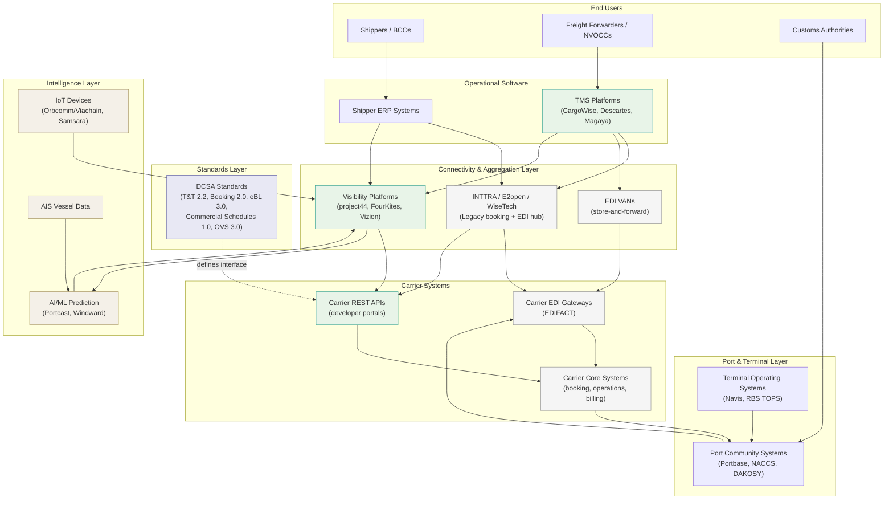

# Shipping Technology Landscape

A survey of the technology ecosystem in containerized ocean shipping -- from legacy EDI to modern APIs, carrier platforms, and emerging intelligence layers. Written for someone evaluating where product opportunities exist in carrier data integration.

---

## 1. EDI: The 30-Year Backbone

### What EDI Is

Electronic Data Interchange (EDI) is the computer-to-computer exchange of structured business documents in standardized formats. In ocean shipping, the dominant standard is **UN/EDIFACT** (United Nations Electronic Data Interchange for Administration, Commerce and Transport), maintained by the UN Centre for Trade Facilitation and Electronic Business. EDIFACT defines rigid message structures with fixed segment hierarchies, data elements, and qualifiers.

EDI messages are typically exchanged through **Value-Added Networks (VANs)** -- private intermediary networks that route, translate, and store-and-forward messages between trading partners. VANs charge per-transaction or subscription fees and handle protocol translation, delivery confirmation, and audit trails.

### Key Message Types in Ocean Shipping

| Message | Full Name | Purpose |
|---------|-----------|---------|
| **IFTMIN** | Instruction for Transport (Minimum) | Shipping instructions / booking requests from shipper to carrier |
| **COPARN** | Container Release/Acceptance Order | Container release orders from carrier to terminal or depot |
| **BAPLIE** | Bay Plan / Stowage Plan | Vessel loading plan with container positions, weights, and types |
| **CUSCAR** | Customs Cargo Report | Cargo manifest data from carrier to customs authority |
| **IFTSTA** | International Multimodal Status Report | Transport status updates and event reporting |
| **COPINO** | Container Pre-notification | Inland carrier notification of container delivery/pickup at terminal |
| **COARRI** | Container Discharge/Loading Report | Confirmation of container load/discharge from vessel |
| **CODECO** | Container Gate-In/Gate-Out Report | Container movements through terminal gates |

These messages form a complete workflow: a booking is placed (IFTMIN), containers are released (COPARN), pre-notified for gate arrival (COPINO), loaded per a bay plan (BAPLIE), tracked in transit (IFTSTA), and reported to customs (CUSCAR).

### Why Shipping Still Runs on EDI

Three forces keep EDI entrenched:

1. **Legacy systems**: Carrier core systems (often mainframe-based) were built around EDIFACT message flows. Rearchitecting them is a multi-year, high-risk endeavor.
2. **Reliability**: EDI/VAN infrastructure has decades of proven uptime. The store-and-forward model handles network interruptions gracefully.
3. **Regulatory acceptance**: Customs authorities worldwide accept EDIFACT messages as legally binding documents. CUSCAR and its variants are embedded in trade compliance frameworks globally.

### Why EDI Is Being Displaced

Despite its entrenchment, EDI has structural limitations that increasingly frustrate modern logistics operations:

- **Cost**: VAN transaction fees accumulate quickly for high-volume shippers. A forwarder processing thousands of bookings monthly can spend six figures annually on VAN fees alone.
- **Rigidity**: Changing an EDI mapping requires coordinated effort between both trading partners. Adding a new data field can take months of specification work and testing.
- **No real-time capability**: EDI is batch-oriented. Messages are queued, routed through VANs, and processed on polling intervals -- introducing latency from minutes to hours.
- **Specialized expertise**: EDIFACT message design requires niche technical knowledge. Parsing a BAPLIE message is not something a typical web developer can do without significant ramp-up.
- **VAN vendor lock-in**: Switching VANs or adding new trading partners involves migration projects rather than simple API key provisioning.

### The EDI-to-API Transition: Where We Are

The transition is real but gradual. Most large carriers now offer REST APIs alongside their EDI channels, but they have not turned off EDI -- and won't for years. The coexistence period means that any integration platform must handle both paradigms. Direct communication methods like AS2 and HTTPS are displacing VANs for some EDI exchanges as an intermediate step, but the fundamental shift is from EDIFACT message structures to JSON/REST APIs with DCSA-aligned schemas.

---

## 2. INTTRA / E2open / WiseTech: The Incumbent Platform

### Origin Story

INTTRA was founded in 2001 as a joint venture between six major carriers: **CMA CGM, Hamburg Sud, Hapag-Lloyd, Maersk Line, MSC, and UASC**. The founding mission was straightforward -- create a standard electronic commerce platform so that forwarders and shippers could submit bookings, shipping instructions, and tracking requests to multiple carriers through a single interface, rather than maintaining separate EDI connections to each.

### What INTTRA Does

The platform digitized four core workflows:

- **Container Booking**: Submit and manage bookings across 60+ carriers
- **Shipping Instructions**: Electronic transmission of documentation to carriers
- **Track & Trace**: Unified container status tracking across the carrier network
- **Ocean Schedules**: Centralized schedule data from connected carriers

At its peak, INTTRA processed roughly **one in every four ocean containers shipped globally** through its platform. The network grew to over 30,000 active shippers across 200+ countries, 60+ carriers, and 150+ software integration partners. The carrier network represents approximately 71% of world ocean container capacity.

### Acquisition History

**2017**: INTTRA acquired Avantida, extending from ocean into land-based container logistics and repositioning.

**2018**: E2open acquired INTTRA for an undisclosed sum, merging it into E2open's broader supply chain management platform. The stated goal was creating "a unified global logistics and supply chain network."

**2025**: WiseTech Global (parent of CargoWise) acquired E2open for **$2.1 billion**, completing the deal in August 2025. This brought INTTRA under the same corporate umbrella as CargoWise, the dominant TMS for freight forwarders. Analysts estimated the combined entity could control up to 40% of the global container market.

### Why INTTRA Is Perceived as Legacy

Despite its massive network, INTTRA carries significant baggage:

- **Buried in layers of acquisition**: INTTRA is now a product line within E2open within WiseTech Global. Strategic investment and product focus are diluted across a sprawling enterprise software portfolio.
- **Dated UX**: The platform reflects its early-2000s origins. The interface and workflows have not kept pace with modern web application standards.
- **EDI-centric architecture**: INTTRA was built in the EDI era and still fundamentally operates as an EDI translation layer, even as it adds API capabilities.
- **Pricing opacity**: While the base booking platform has historically been free for shippers (carriers pay for connectivity), the broader E2open platform carries enterprise pricing. INTTRA's economics increasingly serve the parent company's enterprise software sales motion rather than the forwarder community.
- **Slow modernization**: As carriers launch their own developer portals with REST APIs, INTTRA's value as a connectivity intermediary diminishes. The platform adds the most value for carriers that lack direct API access -- but those are precisely the carriers INTTRA has the weakest connections to.

### Current Strategic Position

The WiseTech acquisition creates an interesting dynamic. CargoWise (WiseTech's flagship TMS, discussed below) already dominates the forwarder software market. Combining CargoWise with INTTRA's carrier network creates a vertically integrated stack: forwarders use CargoWise for operations and INTTRA for carrier connectivity. Whether this integration materializes as a seamless product or remains a collection of acquired brands will determine INTTRA's relevance in the coming years.

---

## 3. DCSA Standards: The Industry's Standardization Push

### What DCSA Is

The **Digital Container Shipping Association (DCSA)** was founded in April 2019 by nine major carriers: **MSC, Maersk, CMA CGM, Hapag-Lloyd, ONE (Ocean Network Express), Evergreen, Yang Ming, HMM, and ZIM**. These nine carriers collectively control approximately 80% of global container shipping capacity.

DCSA's mission is to establish open IT standards that enable interoperability across the container shipping industry. The organization published its **Industry Blueprint** in 2019, defining a common vocabulary and process framework for digital data exchange.

### The Standards

| Standard | Latest Version | Status | Purpose |
|----------|---------------|--------|---------|
| **Track & Trace (T&T)** | v2.2 | Production (most members) | Container and shipment event tracking with subscription capability |
| **Booking** | v2.0 (final) | Deploying (HMM by end 2025) | Standardized booking request and confirmation workflow |
| **Bill of Lading (eBL)** | v3.0 (final) | Deploying | Electronic bill of lading with digital signatures |
| **Commercial Schedules** | v1.0 | Deploying (MSC adopted) | Point-to-point routing, port schedules, vessel schedules |
| **Operational Vessel Schedules (OVS)** | v3.0 | Production | Vessel rotation and port call schedule data |
| **IoT** | In development | Standards phase | Container sensor data (temperature, humidity, GPS, door status) |

The Booking 2.0 and Bill of Lading 3.0 standards, released in early 2025, introduce 190+ attributes to Shipping Instructions for ICS2 (Import Control System 2) compliance and add digital signatures to the eBL for integrity and non-repudiation.

### Adoption Status

Track & Trace has the broadest adoption: a majority of DCSA member carriers have the T&T API in production or testing. The commitment to full eBL adoption by 2030 was made by all DCSA members in February 2023, and the first successful exchange of a fully interoperable eBL was demonstrated at DCSA Week 2025.

Commercial Schedules adoption is gaining momentum. MSC has fully adopted the Point-to-Point endpoint and is developing Vessel Schedule and Port Schedule endpoints. The standard offers three consumption patterns: point-to-point routing (end-to-end route options for pre-booking), port schedules (vessel arrivals/departures at a given port), and vessel schedules (full rotation for a service/voyage).

### The DCSA+ Partnership Programme

Launched in March 2025, **DCSA+** extends participation beyond carriers to technology providers, cargo owners, freight forwarders, feeders, and terminals. Partners receive direct implementation support, access to a digital implementation portal with step-by-step playbooks, participation in early-stage standard testing, and previews of the DCSA roadmap. WNS joined in July 2025; VIACHAIN joined in 2026 for IoT standards work.

### What DCSA Does Not Solve

- **Not all carriers are members**: The nine founding members cover ~80% of capacity, but dozens of smaller carriers operate outside DCSA entirely.
- **Implementation varies**: DCSA defines the API contract, not the implementation quality. Response times, data freshness, error handling, and data completeness vary significantly across carriers even when they claim DCSA compliance.
- **No enforcement mechanism**: Compliance is voluntary. A carrier can claim DCSA alignment while implementing only a subset of the specification.
- **The long tail**: Regional carriers, feeder operators, and niche trade-lane specialists are unlikely to implement DCSA APIs -- they lack the engineering resources. This means any real-world integration platform still needs to handle non-DCSA data sources.

---

## 4. Carrier Developer Portals: The New Wave

### The Trend

Major carriers are investing in developer portals that expose REST APIs for direct integration. This is a fundamental shift from the EDI/INTTRA model -- carriers now want developers to build directly against their systems.

| Carrier | Portal | API Capabilities | Authentication |
|---------|--------|-----------------|----------------|
| **Maersk** | developer.maersk.com | Tracking, booking, booking status, schedules (point-to-point), ocean products | OAuth2 + API Key (dual, path-dependent) |
| **CMA CGM** | api-portal.cma-cgm.com | Tracking, schedules, booking, documentation | API Key |
| **Hapag-Lloyd** | hapag-lloyd.com/api-portal | Tracking, schedules, interactive vessel schedule | IBM API Connect API Key |
| **MSC** | Partner-gated | Tracking, commercial schedules (DCSA) | Partner onboarding required |
| **ONE** | developers.one-line.com | Tracking, schedules | Account-based |
| **ZIM** | api.zim.com (Azure APIM) | Tracking, schedules, booking | Azure API Management keys |
| **Evergreen** | Partner API | Tracking, schedules | JWT (Client ID/Secret) |

### What Is Available

**Tracking** is universally available -- every carrier with an API offers container/shipment tracking. **Schedules** are broadly available, increasingly aligned with DCSA Commercial Schedules. **Booking** is offered by several carriers (Maersk, CMA CGM) but remains less mature and sometimes limited to specific customer tiers. **Rates** are rare -- Maersk has experimented with spot rate APIs, but most carriers keep rate data behind negotiated contracts and legacy quoting systems.

### The Long Tail Problem

The top 10 carriers by capacity have developer portals or partner API programs. But the ocean shipping market includes dozens of smaller carriers -- regional operators, feeder services, niche trade-lane specialists -- that have no API at all. Their data is accessible only through EDI, web scraping, or manual processes. This long tail is a persistent challenge for anyone building unified carrier integrations: you cannot achieve comprehensive coverage through APIs alone.

---

## 5. Visibility Platforms: The Modern Layer

Real-time transportation visibility platforms (RTTVPs) aggregate carrier data, normalize it, and provide unified tracking with predictive analytics. The market has matured rapidly.

**Key players**: project44 (leading with 9.2% market share in 2025, 1,400+ telematics integrations), FourKites, Shippeo, and Vizion (ocean-focused). These platforms track shipments across road, rail, ocean, air, and parcel, using predictive ETAs and analytics to surface exceptions.

The visibility platform market is distinct from carrier API integration in an important way: visibility platforms are **end-user products** designed for supply chain operations teams, not developer tools for building custom integrations. They solve the "give me a dashboard" problem, not the "let me build carrier data into my own systems" problem.

The broader freight visibility software market is projected to grow significantly through 2030, driven by supply chain disruption awareness post-COVID and increasingly sophisticated AI-powered prediction capabilities.

> Note: Detailed competitive analysis of tracking aggregators and visibility platforms is covered in a separate document.

---

## 6. TMS Platforms: The Forwarder's Operational Backbone

### What They Are

Transportation Management Systems (TMS) are the core operational software for freight forwarders and large shippers. They handle quoting, booking, documentation, customs brokerage, warehouse management, accounting, and reporting. A forwarder's TMS is the system of record for their business.

### The Market

| Platform | Owner | Position | Carrier Connectivity |
|----------|-------|----------|---------------------|
| **CargoWise** | WiseTech Global | Dominant (~70% of forwarding software market, $16B market cap) | Built-in EDI, INTTRA (now owned), growing direct API |
| **Descartes** | Descartes Systems Group | Strong in compliance, customs, denied party screening (~$10B market cap) | EDI, regulatory data feeds |
| **Magaya** | Magaya | North American SME market, lower cost, modular | EDI, some API integrations |
| **GoFreight** | GoFreight | Growing challenger, modern UI, cloud-native | API-first approach |
| **Softship** | WiseTech Global (acquired) | Legacy ocean freight specialist | EDI-centric |

### Why TMS Incumbency Matters

The TMS is where carrier data ultimately needs to land. A forwarder does not want to check a separate dashboard for tracking -- they want container milestones to appear inside their CargoWise workflow. This means:

1. **CargoWise is the gravitational center**: With ~70% market share and now owning both INTTRA and Softship, WiseTech controls the dominant path from carrier to forwarder.
2. **Integration is the moat**: Any new carrier data product must either integrate with CargoWise or convince forwarders to check a separate system -- a hard sell.
3. **The WiseTech consolidation play**: The E2open/INTTRA acquisition in 2025 signals WiseTech's intent to own the full carrier-to-forwarder data pipeline. This vertical integration could squeeze out intermediary platforms.

---

## 7. Port Community Systems and Terminal Operating Systems

### Port Community Systems (PCS)

PCS platforms are shared data infrastructure at the port level, connecting shipping lines, terminals, customs authorities, truckers, and other port stakeholders through a centralized electronic messaging hub.

| System | Location | Scale |
|--------|----------|-------|
| **Portbase** | Netherlands (Rotterdam, Amsterdam) | 40+ services, 3,200+ companies, all Dutch ports |
| **NACCS** | Japan | National customs and port processing system |
| **DAKOSY** | Germany (Hamburg) | Cargo, customs, and port logistics |
| **CODECO-based systems** | Various | Gate-in/gate-out messaging at container terminals worldwide |

PCS platforms play a role in the data flow by generating terminal events (gate-in, gate-out, vessel loading, discharge) that feed into carrier tracking systems. They are generally not directly accessible to third-party developers -- they serve their port community members.

### Terminal Operating Systems (TOS)

TOS software controls container movements and storage within a port terminal. Key vendors include **Navis (Cargotec)**, **RBS TOPS**, and **Kaleris**. TOS systems generate the ground-truth data for terminal events but are internal to terminal operators. Their data surfaces to the outside world through PCS messaging (CODECO, COARRI) and carrier event feeds.

---

## 8. Emerging Technology

### AI/ML for ETA Prediction

Carrier-provided ETAs are notoriously inaccurate. A growing category of companies applies machine learning to improve predictions:

- **Portcast**: Predictive ETAs proven to be ~30% more accurate than carrier estimates 2-4 weeks ahead of arrival. Acquired by Siemens for supply chain visibility integration.
- **Windward AI**: Maritime intelligence platform using 12+ years of vessel signal data. Their Maritime AI predicted ETAs outperform carrier estimates for two out of three containers traded globally, cutting by half the number of predictions that are off by 5+ days. ETAs are validated and updated every 10 minutes.

These capabilities are increasingly integrated into visibility platforms (project44, FourKites) rather than sold standalone.

### TradeLens: The Cautionary Blockchain Tale

**TradeLens**, a joint venture between Maersk and IBM launched in 2018, was the highest-profile attempt to apply blockchain to shipping documentation and data sharing. The platform was discontinued in late 2022 after failing to reach commercial viability. Key lessons:

- **Governance over technology**: The fundamental problem was not blockchain's capability but competitors' unwillingness to share data on a Maersk-controlled platform. MSC and CMA CGM eventually joined in 2019 after governance model changes, but shippers and freight forwarders never adopted at scale.
- **Cost without clear value**: The platform's technology costs were high, and customers questioned whether a simpler (non-blockchain) solution could deliver the same benefits at lower cost.
- **Data sovereignty concerns**: Carriers and forwarders were uncomfortable with data flowing through a platform controlled by their largest competitor.
- **Estimated investment**: $100M+ between Maersk and IBM, written off entirely.

The TradeLens failure reinforced that in shipping, **neutral governance and clear data ownership** matter more than technology sophistication. Any platform that appears controlled by a single large carrier will struggle to attract the rest of the industry.

### IoT Container Tracking

Smart container devices provide real-time GPS location, temperature, humidity, door status, and movement/shock data throughout the supply chain.

- **Orbcomm (now Viachain)**: Market leader in smart container IoT. The CT 1000 is a solar-powered device with cellular connectivity, GPS, ambient temperature monitoring, and door sensors. Launched CrewView in 2025 for onboard vessel monitoring of reefer and dry containers at sea.
- **Samsara**: Fleet and container tracking with cold chain monitoring, integrating with Thermo King and Carrier refrigeration units.

The market is growing rapidly: connected container tracking devices are projected to grow from **6.1 million in 2024 to 19.2 million by 2034**. DCSA is developing IoT standards to normalize sensor data across devices and carriers.

### Digital Freight Platforms

**Flexport** has been the most visible disruptor, reaching $2.1 billion in revenue in 2024 (up 30% YoY). Flexport's model -- a tech-enabled freight forwarder rather than a pure software company -- demonstrated that modern interfaces and data visibility could win market share from traditional forwarders. The broader digital freight forwarding market was valued at $33.6 billion in 2024 and is projected to reach $94.8 billion by 2030 (18.8% CAGR).

Flexport's impact on the technology landscape is indirect but significant: it raised customer expectations for data quality, real-time tracking, and modern UX in an industry accustomed to phone calls, emails, and spreadsheets.

---

## 9. Technology Stack Diagram

The following diagram illustrates how these technology layers stack and interact in a modern shipping operation:

### Reading the Diagram

The technology landscape has four broad layers:

1. **Legacy (gray)**: EDI gateways, VANs, INTTRA, and carrier core systems. Still carrying the majority of transaction volume but gradually being supplemented.
2. **Modern (green)**: Carrier REST APIs, visibility platforms, and TMS systems. Where active investment and innovation are concentrated.
3. **Standards (blue)**: DCSA specifications that define the interface contract between carriers and the rest of the ecosystem.
4. **Emerging (amber)**: AI prediction, IoT devices, and vessel tracking data. Increasingly integrated into the modern layer but not yet universally adopted.

The critical insight for product strategy: the connectivity and aggregation layer -- where INTTRA, VANs, and visibility platforms sit -- is where the most disruption and consolidation is happening. WiseTech's acquisition of E2open/INTTRA is a consolidation play. Visibility platforms are expanding capabilities. And carriers' own developer portals are enabling direct integration for the first time, potentially disintermediating the aggregation layer entirely for technically sophisticated consumers.

---

## Sources

- [E2open Completes Acquisition of INTTRA](https://www.inttra.com/newsroom/e2open-completes-acquisition-of-inttra-bringing-together-leading-global-cloud-supply-chain-management-and-leading-ocean-shipping-network/)
- [WiseTech Global Announces Strategic Acquisition of E2open](https://www.wisetechglobal.com/news/wisetech-global-announces-strategic-acquisition-of-e2open/)
- [WiseTech Global Completes Strategic Acquisition of E2open](https://www.wisetechglobal.com/news/wisetech-global-completes-strategic-acquisition-of-e2open/)
- [INTTRA: Our Story](https://www.inttra.com/about/our-story/)
- [Inttra by E2open: Must-knows for Ocean Booking (BuyCo)](https://buyco.co/insights/inttra-e2open-ocean-booking/)
- [DCSA: About Us](https://dcsa.org/about-us)
- [DCSA Standards](https://dcsa.org/standards)
- [DCSA Track & Trace Standards Adopted by Majority of Member Carriers](https://dcsa.org/resource/dcsa-track-trace-standards-adopted-member-carriers/)
- [DCSA Releases Final Versions of Booking 2.0 and Bill of Lading 3.0](https://dcsa.org/newsroom/final-versions-of-booking-bill-of-lading-standards-released)
- [DCSA Releases Track & Trace Interface Standard Version 2.2](https://dcsa.org/newsroom/dcsa-releases-track-trace-interface-standard-version-2-2)
- [DCSA Launches DCSA+ Partnership Programme](https://dcsa.org/newsroom/dcsa-launches-dcsa-partnership-programme-to-connect-key-industry-stakeholders)
- [DCSA Commercial Schedules](https://dcsa.org/standards/commercial-schedules)
- [MSC's Adoption of the DCSA Commercial Schedules API](https://www.msc.com/en/lp/blog/technology/msc-adopts-dcsa-commercial-schedule-api)
- [DCSA Week 2025 Wrap-Up](https://dcsa.org/newsroom/dcsaweekwrapup)
- [WNS Joins DCSA+](https://dcsa.org/newsroom/wns_dcsaplus_partnership_release)
- [Maersk API Catalogue](https://developer.maersk.com/api-catalogue)
- [CMA CGM API Portal](https://api-portal.cma-cgm.com/)
- [Hapag-Lloyd API Portal](https://www.hapag-lloyd.com/en/services-information/data-solutions/api-portal.html)
- [ZIM API Portal](https://api.zim.com/)
- [ONE Developer Portal](https://developers.one-line.com/get-started)
- [Maersk and IBM Discontinue TradeLens](https://www.maersk.com/news/articles/2022/11/29/maersk-and-ibm-to-discontinue-tradelens)
- [The Termination of the TradeLens Blockchain Platform (Ferrari Group)](https://theferrarigroup.com/the-termination-of-the-tradelens-blockchain-platform-are-lessons-being-learned/)
- [WiseTech Acquisition of E2open Analysis (Wisechain Consult)](https://wisechainconsult.substack.com/p/wisetech-and-e2open-what-it-means)
- [CargoWise Pricing 2026: Understanding the New Value Pack Model (GoFreight)](https://gofreight.com/blog/cargowise-pricing-2025)
- [WiseTech Global Market Share (6sense)](https://6sense.com/tech/fleet-management-and-logistics/wisetech-global-market-share)
- [Real-Time Transportation Visibility Platforms Report 2025 (ResearchAndMarkets)](https://www.businesswire.com/news/home/20250820985707/en/Real-Time-Transportation-Visibility-Platforms-Report-2025-Project44-FourKites-and-Shippeo-Lead-the-Charge-in-Visibility-Platforms---ResearchAndMarkets.com)
- [Container Tracking: 19.2M Connected Devices by 2034 (Transforma Insights)](https://transformainsights.com/research/reports/container-tracking)
- [Orbcomm/Viachain Smart Container IoT Solutions](https://www.orbcomm.com/en/solutions/maritime/shipping-container-monitoring)
- [Portcast Predictive Visibility](https://www.portcast.io/predictive-visibility)
- [Windward AI Vessel ETA Prediction](https://windward.ai/solutions/vessel-eta/)
- [Flexport Revenue and Valuation (Sacra)](https://sacra.com/c/flexport/)
- [Digital Freight Forwarding Market Forecast (Yahoo Finance / ResearchAndMarkets)](https://finance.yahoo.com/news/digital-freight-forwarding-strategic-industry-144100366.html)
- [Portbase Port Community System](https://www.portofrotterdam.com/en/services/online-tools/port-community-system)
- [EDI VAN Decline (EDI2XML)](https://www.edi2xml.com/blog/what-is-a-van/)
- [Connectivity in Transportation: API, EDI, and e-AWB (CoaxSoft)](https://coaxsoft.com/blog/a-full-guide-to-connectivity-in-transportation)
- [EDIFACT BAPLIE Documentation (Stedi)](https://www.stedi.com/edi/edifact/messages/BAPLIE)
- [EDIFACT CUSCAR Documentation (EdiFabric)](https://support.edifabric.com/hc/en-us/articles/360008380411-EDIFACT-CUSCAR-Cargo-Report)
- [COPINO Container Pre-notification (1EDI Source)](https://www.1edisource.com/resources/edi-transactions-sets/edi-copino/)
